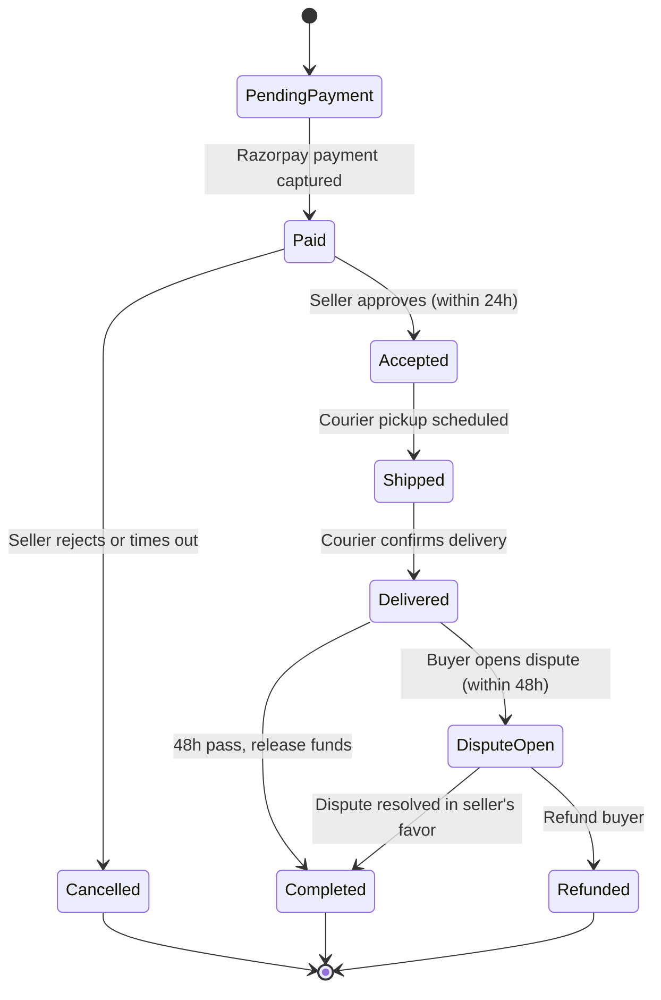
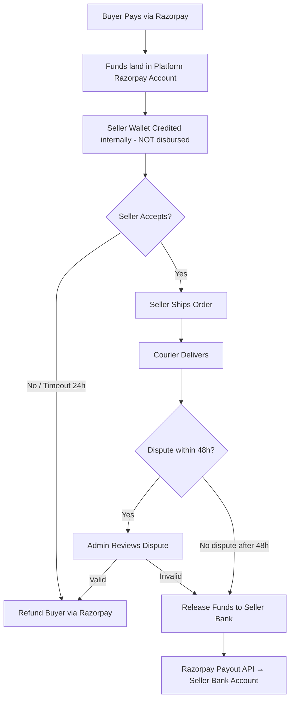
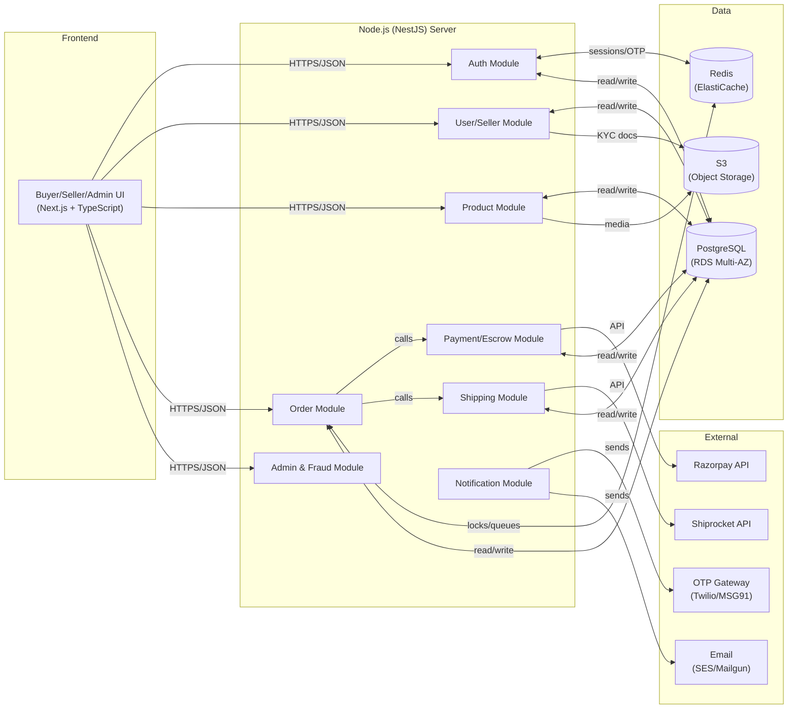
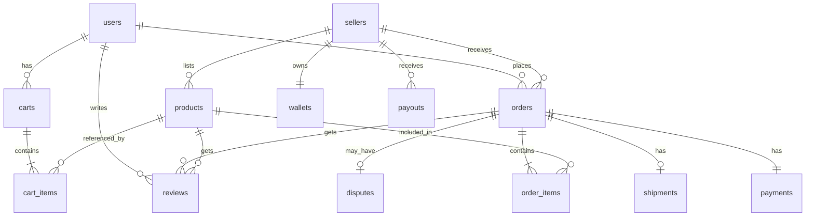
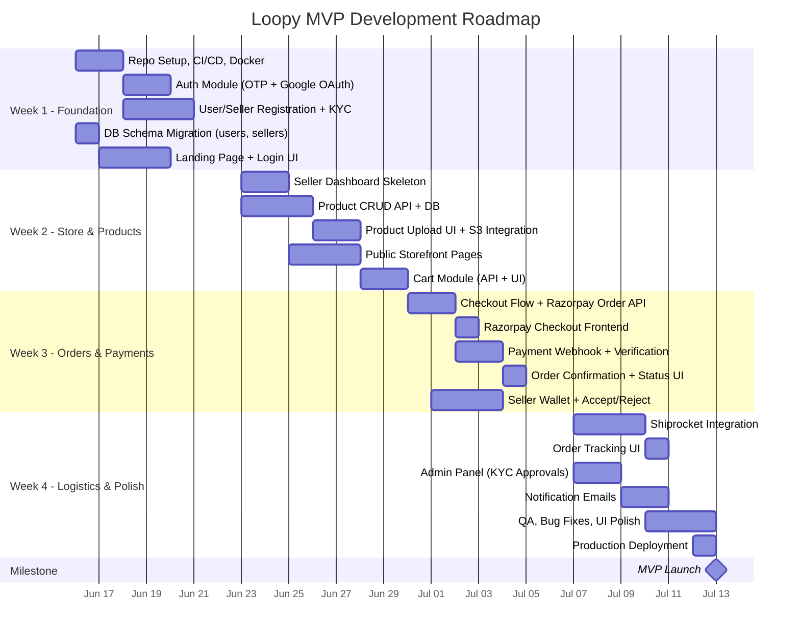

# Technical Product Requirements Document (PRD)
## Loopy — Social-Commerce Thrift Marketplace

| Field | Detail |
|-------|--------|
| **Document Version** | 1.0 |
| **Last Updated** | 2026-06-10 |
| **Product Name** | Loopy |
| **Product Type** | Social-Commerce Multi-Tenant Marketplace (Web, PWA) |
| **Target Launch** | MVP in 3–4 weeks from development start |
| **Authors** | Product & Engineering Team |

---

## Table of Contents

1. [Product Overview](#1-product-overview)
2. [Target Users & Personas](#2-target-users--personas)
3. [User Requirements & Pain Points](#3-user-requirements--pain-points)
4. [Functional Requirements](#4-functional-requirements)
5. [Non-Functional Requirements](#5-non-functional-requirements)
6. [Use Cases](#6-use-cases)
7. [Wireframes & UI/UX Specifications](#7-wireframes--uiux-specifications)
8. [Technical Architecture & Specifications](#8-technical-architecture--specifications)
9. [Database Design](#9-database-design)
10. [API Design](#10-api-design)
11. [Dependencies](#11-dependencies)
12. [Risk Matrix & Mitigations](#12-risk-matrix--mitigations)
13. [Timeline & Milestones](#13-timeline--milestones)
14. [Success Metrics](#14-success-metrics)
15. [Glossary](#15-glossary)

---

## 1. Product Overview

### 1.1 Vision

Loopy is an **Instagram thrift sellers' Shopify** — a social-commerce platform enabling India's thrift clothing sellers to launch their own branded online stores, manage inventory, process payments securely, and ship orders to buyers, all from a single dashboard.

### 1.2 Problem Statement

Instagram thrift sellers in India currently rely on DMs, manual payment collection (UPI screenshots), and unstructured logistics. This leads to:

- **No trust infrastructure** — buyers risk getting scammed; sellers risk chargebacks
- **No centralized order management** — sellers juggle spreadsheets, WhatsApp, and Instagram DMs
- **No integrated payments or escrow** — no buyer protection, no dispute resolution
- **No shipping automation** — sellers manually arrange couriers, creating friction and delays

### 1.3 Solution

Loopy provides each seller an **independent online storefront** (e.g., `loopy.com/s/{sellername}`) with:

- Integrated **Razorpay payments** with a **48-hour escrow hold** for buyer protection
- **Shiprocket logistics** integration for automated shipping, tracking, and returns
- **Seller KYC verification** and trust badges for buyer confidence
- A **5% platform commission** (added to buyer cost) — no subscription fees

### 1.4 Competitive Positioning

| Platform | Commission | Seller Payout | Key Differentiator |
|----------|-----------|---------------|-------------------|
| **DM2Buy** | 0% | Next bank day (Cashfree) | Free, no-code, Instagram-focused |
| **Loopy (Ours)** | ~5% (buyer-paid) | 48h hold → manual payout | Escrow trust, logistics, fraud scoring, seller KYC |
| **ZThrifts/Jettrips** | Undisclosed (higher) | Undisclosed | Curated vintage, quality-checked |
| **Instagram Shopping** | N/A | N/A | No Indian payment integration yet |

> [!IMPORTANT]
> **Positioning**: Loopy combines DM2Buy's easy onboarding with Jettrips' trust infrastructure, creating a secure, value-added layer that justifies the 5% commission.

### 1.5 Revenue Model

| Revenue Stream | Description | MVP Status |
|---------------|-------------|------------|
| Platform Commission | 5% on each order (added to buyer's cost) | ✅ Active |
| Subscription Plans | Tiered seller plans with premium features | ❌ Post-MVP |
| Promoted Listings | Paid visibility boost for seller products | ❌ Post-MVP |
| Custom Domains | Seller-branded domains (e.g., `sellername.com`) | ❌ Post-MVP |

---

## 2. Target Users & Personas

### 2.1 Primary Personas

#### Persona 1: Thrift Seller (Priya, 22, Bangalore)

| Attribute | Detail |
|-----------|--------|
| **Background** | Runs a thrift clothing business via Instagram; 2K followers |
| **Goals** | Professional store, reliable payments, hassle-free shipping |
| **Pain Points** | Manually tracking orders via DMs, no payment protection, time wasted on logistics |
| **Tech Comfort** | Moderate — uses Instagram, UPI, basic phone apps |
| **Device** | Android smartphone (primary), occasionally laptop |

#### Persona 2: Thrift Buyer (Ananya, 19, Delhi)

| Attribute | Detail |
|-----------|--------|
| **Background** | College student who shops for affordable, unique clothing online |
| **Goals** | Discover trendy thrift pieces, pay securely, track orders |
| **Pain Points** | Fear of scams from unknown Instagram sellers, no refund recourse |
| **Tech Comfort** | High — comfortable with online shopping, UPI |
| **Device** | Android smartphone |

#### Persona 3: Platform Admin (Internal Team)

| Attribute | Detail |
|-----------|--------|
| **Background** | Loopy operations team member |
| **Goals** | Approve sellers, resolve disputes, monitor platform health |
| **Pain Points** | Manual processes, lack of dashboards for decision-making |

### 2.2 Scale Assumptions (MVP)

| Metric | MVP Target | Year 1 Target |
|--------|-----------|---------------|
| Active Sellers | ~15 | 100+ |
| Monthly Orders | 100–500 | Thousands |
| Concurrent Users | 100 | 1,000+ |
| Orders/Minute | 10 | 1,000 |

---

## 3. User Requirements & Pain Points

### 3.1 Seller Requirements

| ID | Requirement | Priority | Pain Point Addressed |
|----|------------|----------|---------------------|
| SR-01 | Create and customize a branded online store | P0 | No professional storefront beyond Instagram |
| SR-02 | Upload and manage product listings (images, pricing, sizes) | P0 | Manual inventory tracking via spreadsheets |
| SR-03 | Receive and manage orders with status tracking | P0 | Orders lost in DM chaos |
| SR-04 | Secure, timely payouts to bank account | P0 | Manual UPI collection, payment disputes |
| SR-05 | Integrated shipping with label generation and tracking | P0 | Manual courier arrangement |
| SR-06 | View sales analytics and wallet balance | P1 | No business intelligence |
| SR-07 | KYC verification for trust badge | P0 | Buyers don't trust unknown sellers |
| SR-08 | Notification of new orders, shipping updates | P1 | Missed orders and delayed responses |

### 3.2 Buyer Requirements

| ID | Requirement | Priority | Pain Point Addressed |
|----|------------|----------|---------------------|
| BR-01 | Browse seller stores and discover products | P0 | Hard to find thrift products outside Instagram |
| BR-02 | Secure online payment (UPI, cards, netbanking) | P0 | Risky manual UPI transfers to strangers |
| BR-03 | 48-hour escrow protection after delivery | P0 | No refund recourse if scammed |
| BR-04 | Real-time order tracking | P0 | No visibility into shipping status |
| BR-05 | Rate and review sellers/products | P1 | No way to verify seller quality |
| BR-06 | Easy returns/refunds with evidence submission | P1 | Disputes are unstructured and unresolvable |
| BR-07 | Mobile-first, fast shopping experience | P0 | Poor mobile UX on existing platforms |

### 3.3 Admin Requirements

| ID | Requirement | Priority |
|----|------------|----------|
| AR-01 | Review and approve/reject seller KYC applications | P0 |
| AR-02 | Manage and resolve buyer-seller disputes | P0 |
| AR-03 | View platform analytics (GMV, active sellers, orders) | P1 |
| AR-04 | Flag and moderate suspicious activity | P1 |

---

## 4. Functional Requirements

### Module 1: Authentication & Authorization

| ID | Feature | Description | Acceptance Criteria |
|----|---------|-------------|-------------------|
| FR-AUTH-01 | OTP Login | User enters phone/email → receives OTP → verifies → receives JWT | OTP delivered within 10s; JWT issued on correct OTP; 5-min OTP expiry |
| FR-AUTH-02 | Google OAuth | One-click Google sign-in linking to user account | Google ID linked to `users` record; JWT issued on success |
| FR-AUTH-03 | JWT Token Management | Access token (15-min) + refresh token (7-day) rotation | Expired access tokens rejected; refresh token renews access seamlessly |
| FR-AUTH-04 | Role-Based Access Control | Roles: Buyer, Seller, Admin with route-level guards | Seller APIs return 403 for buyers; Admin APIs return 403 for non-admins |
| FR-AUTH-05 | Rate-Limited Login | Max 5 failed OTP attempts per hour per user | 6th attempt returns 429; resets after cooldown |

---

### Module 2: Seller Onboarding & KYC

| ID | Feature | Description | Acceptance Criteria |
|----|---------|-------------|-------------------|
| FR-SELL-01 | Seller Registration | Multi-step form: store name, username, bio, bank details | Unique username enforced; account created with status `Pending` |
| FR-SELL-02 | KYC Document Upload | Upload PAN, Aadhaar, bank proof via signed S3 URLs | Files stored in S3; PAN format and Aadhaar length validated |
| FR-SELL-03 | Admin KYC Review | Admin views submitted docs and approves/rejects | On approval: `kyc_status = approved`, Razorpay Contact/Fund Account created |
| FR-SELL-04 | Store Customization | Seller sets banner, logo, bio, shipping rates | Changes reflected on public storefront within 1 refresh |
| FR-SELL-05 | Seller Verification Badge | "Verified Seller" badge displayed after KYC approval | Badge visible on storefront and product pages |

---

### Module 3: Product Management

| ID | Feature | Description | Acceptance Criteria |
|----|---------|-------------|-------------------|
| FR-PROD-01 | Product CRUD | Create, read, update, delete products with images | All mandatory fields enforced (title, images, condition, price); images stored in S3 |
| FR-PROD-02 | Image Upload | Multi-image upload with thumbnail generation | Up to 5 images per product; thumbnails generated server-side |
| FR-PROD-03 | Inventory Management | Track quantity; auto-mark sold-out when qty = 0 | Product marked inactive at qty 0; no purchase possible |
| FR-PROD-04 | Inventory Locking | Redis lock or `SELECT FOR UPDATE` on checkout | Two simultaneous checkouts for qty=1 item: only one succeeds; other gets "sold out" |
| FR-PROD-05 | Product Fields | Title, description, price, condition, size, brand, category, images, quantity | All fields captured; condition is enum (New/Used/Like New) |

---

### Module 4: Cart & Order Management

| ID | Feature | Description | Acceptance Criteria |
|----|---------|-------------|-------------------|
| FR-ORD-01 | Cart Management | Add/remove/update items in cart; persist across sessions | Cart survives browser close (DB-backed for logged-in users) |
| FR-ORD-02 | Checkout Flow | Cart → Address → Payment → Confirmation | Razorpay order created; inventory reserved during payment window |
| FR-ORD-03 | Order Status Tracking | Status enum: `PendingPayment → Paid → Accepted → Shipped → Delivered → Completed` | Status transitions enforced; invalid transitions rejected |
| FR-ORD-04 | Seller Accept/Reject | Seller has 24h to accept paid orders | Auto-cancel + refund if no response in 24h |
| FR-ORD-05 | Order History | Buyer and seller can view past orders with details | Paginated list; filterable by status |

**Order State Machine:**



---

### Module 5: Payment & Escrow

| ID | Feature | Description | Acceptance Criteria |
|----|---------|-------------|-------------------|
| FR-PAY-01 | Razorpay Checkout | Frontend payment via Razorpay (UPI, cards, netbanking) | Payment methods displayed; amount = cart total + shipping + commission |
| FR-PAY-02 | Payment Verification | HMAC signature verification on webhook callback | Invalid signatures rejected (401); valid payments update order status to `Paid` |
| FR-PAY-03 | Escrow Hold (48h) | Funds held in platform wallet; seller balance credited but not disbursed | Seller wallet shows "Pending" balance; no payout before delivery + 48h |
| FR-PAY-04 | Payout to Seller | Razorpay Payout API to seller's bank via Fund Account | Idempotency key prevents double payouts; payout status tracked |
| FR-PAY-05 | Refund Processing | Full/partial refund via Razorpay Refund API | Refund initiated within 24h of dispute approval; buyer notified |
| FR-PAY-06 | Commission Deduction | 5% platform fee subtracted before seller credit | `seller_share = order_amount - commission`; commission logged separately |
| FR-PAY-07 | Seller Wallet | Real-time balance view: available, pending, total paid | Dashboard shows all three values accurately |

**Escrow Flow:**



---

### Module 6: Shipping & Logistics

| ID | Feature | Description | Acceptance Criteria |
|----|---------|-------------|-------------------|
| FR-SHIP-01 | Shiprocket Order Creation | Auto-create shipment on seller acceptance | Shiprocket `order_create` returns `shiprocket_order_id`; stored in DB |
| FR-SHIP-02 | Courier Assignment & AWB | Auto-assign courier via `order_ship` | AWB number generated and stored in `shipments` table |
| FR-SHIP-03 | Pickup Scheduling | Schedule next-day pickup via Shiprocket | Pickup confirmed; seller notified |
| FR-SHIP-04 | Shipping Label | Generate downloadable PDF label | Seller can download label from dashboard |
| FR-SHIP-05 | Real-Time Tracking | Buyer tracks via AWB; updates from Shiprocket webhooks | Tracking page shows: Created → In Transit → Out for Delivery → Delivered |
| FR-SHIP-06 | Manual Shipping | Seller can enter custom courier/AWB if using own logistics | Manual AWB accepted; tracking still displayed |
| FR-SHIP-07 | Return Shipping | Reverse logistics for approved returns | Return pickup scheduled; refund triggered on confirmation |

---

### Module 7: Notifications

| ID | Feature | Description | Channels |
|----|---------|-------------|----------|
| FR-NOTIF-01 | Order Placed | Confirmation to buyer; alert to seller | Email, SMS |
| FR-NOTIF-02 | Payment Confirmed | Receipt to buyer; balance update to seller | Email |
| FR-NOTIF-03 | Order Accepted | Buyer notified seller accepted | Email, Push |
| FR-NOTIF-04 | Shipment Created | AWB + tracking link to buyer | Email, SMS |
| FR-NOTIF-05 | Delivered | Delivery confirmation to both parties | Email, SMS |
| FR-NOTIF-06 | Payout Released | Payout confirmation to seller | Email |
| FR-NOTIF-07 | Dispute Raised | Alert to seller and admin | Email |

---

### Module 8: Admin Panel

| ID | Feature | Description | Acceptance Criteria |
|----|---------|-------------|-------------------|
| FR-ADM-01 | Seller KYC Queue | List pending applications; approve/reject with reason | Approved sellers can list products; rejected get notification |
| FR-ADM-02 | Dispute Resolution | View disputes with evidence; issue refund or release | Resolution updates order status and triggers financial action |
| FR-ADM-03 | Platform Analytics | Dashboard: total GMV, active sellers, orders/day, flagged items | Real-time or daily-refreshed metrics |
| FR-ADM-04 | Content Moderation | Flag/remove inappropriate product listings | Flagged products hidden from storefront |

---

### Module 9: Fraud & Trust

| ID | Feature | Description | Acceptance Criteria |
|----|---------|-------------|-------------------|
| FR-FRAUD-01 | Seller Trust Score | Internal score: signup age, KYC, dispute ratio, ratings | Score computed nightly via cron; visible to admin |
| FR-FRAUD-02 | Order Velocity Limits | Max 3 orders/day per account | 4th order rejected with friendly message |
| FR-FRAUD-03 | Buyer Risk Flags | New account + large order → flagged for review | Admin sees flagged orders with reasons |
| FR-FRAUD-04 | Dispute Evidence | Buyer must upload photo when opening dispute | Dispute rejected if no evidence attached |

---

### Module 10: Analytics (Post-MVP)

| ID | Feature | Description | Priority |
|----|---------|-------------|----------|
| FR-ANLY-01 | Seller Sales Dashboard | Weekly/monthly sales charts, top products | P2 |
| FR-ANLY-02 | Platform Metrics | GMV, payment success rate, order volume | P1 |
| FR-ANLY-03 | Conversion Funnel | Cart → Checkout → Payment success rates | P2 |

---

## 5. Non-Functional Requirements

### 5.1 Performance

| Metric | Target (MVP) | Target (Scale) |
|--------|-------------|----------------|
| API Latency (P95) | < 300ms for reads | < 200ms |
| Concurrent Users | 100 | 1,000+ |
| Order Throughput | 10 orders/min | 1,000 orders/min |
| Page Load Time (Storefront) | < 2s (3G) | < 1.5s |
| Image Load (CDN) | < 500ms | < 300ms |

### 5.2 Scalability

| Aspect | Strategy |
|--------|---------|
| Horizontal Scaling | Stateless Node containers (session in Redis); add instances via autoscaling |
| Database Scaling | Vertical scaling initially; partition orders by date at scale |
| Caching | Redis for product lists, categories, active carts |
| CDN | S3 + CloudFront for product images and static assets |
| Architecture Evolution | Modular monolith → microservices when order volume exceeds 10K/month |

### 5.3 Availability & Reliability

| Metric | Target |
|--------|--------|
| Uptime | 99.9% (critical paths: checkout, payment) |
| Database | Multi-AZ RDS with automated failover |
| Backup | Daily PostgreSQL snapshots; 30-day retention |
| Disaster Recovery | RTO: 4 hours; RPO: 1 hour |

### 5.4 Security

| Requirement | Implementation |
|-------------|---------------|
| Authentication | JWT (access 15m + refresh 7d); OTP via Redis (5m TTL) |
| Data Encryption | TLS 1.3 in transit; AES-256 for PII at rest (Aadhaar, PAN hashed) |
| PCI DSS | Card data never touches our servers (Razorpay handles) |
| OWASP Top 10 | Parameterized queries (ORM), class-validator, CSP headers, HSTS |
| Rate Limiting | Per-IP (1000 req/min) and per-user (5 failed logins/hour) |
| Secret Management | AWS Secrets Manager for API keys, DB credentials |
| Network | VPC with private subnets for DB; WAF on ALB |

### 5.5 Compliance

| Regulation | Approach |
|-----------|----------|
| RBI PA Guidelines | Escrow-like hold; payout only post-delivery; seller KYC mandatory |
| Data Protection (IT Act) | PII encryption; consent on collection; right to deletion |
| PCI DSS | Offloaded to Razorpay (no card data storage) |

### 5.6 Observability

| Tool/Practice | Purpose |
|--------------|---------|
| Structured Logging | Winston/NestJS Logger; request ID, timestamps, user IDs |
| Metrics | Prometheus endpoints: error rates, order rates, payment success |
| Alerting | CloudWatch alarms on 5xx spikes, high latency, queue backlogs |
| Audit Trail | All financial transactions (payouts, refunds) logged with timestamps |

---

## 6. Use Cases

### UC-01: Seller Registration & KYC

| Field | Detail |
|-------|--------|
| **Actor** | Thrift Seller |
| **Precondition** | Seller has PAN, Aadhaar, and bank account details |
| **Trigger** | Seller clicks "Start Selling" on landing page |

**Main Flow:**
1. Seller fills registration form (name, phone, email, store username)
2. System sends OTP → Seller verifies
3. Seller enters store details (name, bio, banner image)
4. Seller uploads KYC documents (PAN, Aadhaar, bank proof)
5. System validates document formats (PAN regex, Aadhaar length)
6. System stores docs in S3 with signed URLs; sets `kyc_status = pending`
7. Admin receives notification of new KYC application
8. Admin reviews and approves → System creates Razorpay Contact + Fund Account
9. Seller receives "Approved" notification and can start listing products

**Exceptions:**
- 2a. OTP delivery fails → Retry or switch to email OTP
- 5a. Invalid document format → Show validation error; seller re-uploads
- 8a. Admin rejects → Seller notified with reason; can resubmit

---

### UC-02: Product Listing

| Field | Detail |
|-------|--------|
| **Actor** | Verified Seller |
| **Precondition** | Seller KYC approved; logged into dashboard |

**Main Flow:**
1. Seller clicks "Add Product" in dashboard
2. Fills form: title, description, price, condition, size, brand, category
3. Uploads 1–5 product images
4. System generates thumbnails; stores in S3
5. Seller sets quantity (default: 1 for unique items)
6. Seller clicks "Publish"
7. Product appears on seller's public storefront

**Exceptions:**
- 3a. Image exceeds size limit → Error shown; seller compresses/re-uploads
- 6a. Missing mandatory fields → Inline validation errors

---

### UC-03: Buyer Browses & Adds to Cart

| Field | Detail |
|-------|--------|
| **Actor** | Buyer |
| **Precondition** | Seller store exists with active products |

**Main Flow:**
1. Buyer visits `loopy.com/s/{sellername}` (shared via Instagram bio link)
2. Sees seller branding (banner, bio, trust badges)
3. Browses product grid; filters by category/size (if available)
4. Clicks product → Views detail page (images, description, price, condition)
5. Clicks "Add to Cart" → Item added
6. System checks inventory availability
7. Buyer can continue shopping or proceed to cart

**Exceptions:**
- 6a. Item out of stock → "Sold Out" displayed; Add to Cart disabled

---

### UC-04: Checkout & Payment

| Field | Detail |
|-------|--------|
| **Actor** | Buyer |
| **Precondition** | Items in cart; buyer logged in |

**Main Flow:**
1. Buyer views cart (items, quantities, subtotal, shipping, commission, total)
2. Clicks "Checkout"
3. Enters/selects shipping address
4. Backend creates Razorpay Order (amount = total)
5. System reserves inventory (Redis lock / DB `SELECT FOR UPDATE`)
6. Razorpay Checkout opens → Buyer pays (UPI/card/netbanking)
7. Razorpay sends webhook → Backend verifies HMAC signature
8. Order status → `Paid`; inventory committed
9. Buyer sees order confirmation page
10. Email/SMS confirmation sent

**Exceptions:**
- 5a. Inventory unavailable (race condition) → Buyer informed "item sold out"; auto-refund if paid
- 6a. Payment fails/declined → Return to cart with error; order not created
- 7a. Webhook signature invalid → Log alert; do not update order
- 6b. Network timeout during payment → Idempotency check prevents duplicate orders

---

### UC-05: Seller Accepts & Ships Order

| Field | Detail |
|-------|--------|
| **Actor** | Seller |
| **Precondition** | Order in `Paid` status |

**Main Flow:**
1. Seller sees new order notification in dashboard
2. Reviews order details (items, buyer info, amount)
3. Clicks "Accept"
4. Order status → `Accepted`
5. Seller clicks "Ship Order"
6. Backend calls Shiprocket `order_create` → gets `shiprocket_order_id`
7. Backend calls `order_ship` → courier assigned, AWB generated
8. Backend calls `order_pickup_schedule` → pickup scheduled
9. Seller downloads shipping label from dashboard
10. Order status → `Shipped`; buyer receives tracking notification

**Exceptions:**
- 3a. Seller clicks "Reject" → Order cancelled; buyer auto-refunded
- 3b. Seller doesn't respond in 24h → Auto-cancel + refund
- 6a. Shiprocket API error → Seller offered manual AWB entry option

---

### UC-06: Order Delivery & Escrow Release

| Field | Detail |
|-------|--------|
| **Actor** | System (automated) / Buyer |
| **Precondition** | Order in `Shipped` status |

**Main Flow:**
1. Shiprocket webhook → delivery confirmed
2. Order status → `Delivered`
3. 48-hour dispute window begins; buyer sees notice
4. No dispute raised within 48h
5. System triggers Razorpay Payout to seller's bank (via Fund Account)
6. Order status → `Completed`
7. Seller receives payout confirmation

**Exceptions:**
- 3a. Buyer opens dispute within 48h → See UC-07
- 5a. Payout fails (bank rejection) → Log error; admin alerted; retry

---

### UC-07: Dispute & Refund

| Field | Detail |
|-------|--------|
| **Actor** | Buyer, Admin |
| **Precondition** | Order delivered; within 48h dispute window |

**Main Flow:**
1. Buyer clicks "Open Dispute" on order page
2. Selects issue type (item not as described, damaged, missing)
3. Uploads evidence photo of received item (mandatory)
4. Dispute logged in `disputes` table; order status → `DisputeOpen`
5. Admin receives dispute notification
6. Admin reviews evidence and order history
7. Admin decides: Refund Buyer OR Release to Seller
8. If refund: Razorpay Refund API called; seller wallet debited; buyer notified
9. If release: funds released to seller; buyer notified of decision

**Exceptions:**
- 3a. No evidence uploaded → Dispute submission blocked
- 8a. Refund API fails → Retry; escalate if persistent

---

### UC-08: Seller Payout Request

| Field | Detail |
|-------|--------|
| **Actor** | Seller |
| **Precondition** | Available balance > 0 in seller wallet |

**Main Flow:**
1. Seller views wallet: available balance, pending, total paid out
2. Clicks "Request Payout"
3. Enters amount (up to available balance)
4. Backend creates Razorpay Payout with idempotency key
5. Payout status: `Processing` → `Paid` (on Razorpay confirmation)
6. Seller balance decremented; payout logged

---

### UC-09: Buyer Reviews Product

| Field | Detail |
|-------|--------|
| **Actor** | Buyer |
| **Precondition** | Order in `Delivered` or `Completed` status |

**Main Flow:**
1. Buyer prompted to review after delivery
2. Submits: rating (1–5 stars), text comment, optional unboxing photo
3. Review saved; visible on product page
4. Seller's aggregate rating updated

---

### UC-10: Admin Approves Seller

| Field | Detail |
|-------|--------|
| **Actor** | Admin |
| **Precondition** | Seller application with `kyc_status = pending` |

**Main Flow:**
1. Admin views pending KYC queue
2. Reviews submitted documents (PAN, Aadhaar, bank proof)
3. Clicks "Approve" (or "Reject" with reason)
4. On approve: Razorpay Contact created → Fund Account created → `kyc_status = approved`
5. Seller notified; can now list products

---

### UC-11: Return & Reverse Logistics

| Field | Detail |
|-------|--------|
| **Actor** | Buyer, Seller |
| **Precondition** | Valid return request approved |

**Main Flow:**
1. Buyer requests return (within return policy window)
2. Admin/Seller approves return
3. Reverse shipment created via Shiprocket (or manual pickup)
4. Courier picks up item from buyer
5. Seller confirms receipt
6. Refund processed via Razorpay; seller wallet adjusted

---

### UC-12: Handling Inventory Race Condition

| Field | Detail |
|-------|--------|
| **Actor** | System |
| **Precondition** | Two buyers attempting to purchase same qty=1 item simultaneously |

**Main Flow:**
1. Buyer A initiates checkout → Redis lock acquired on product ID
2. Buyer B initiates checkout → Lock check fails
3. Buyer A completes payment → Inventory decremented to 0
4. Buyer B sees "Item Sold Out" error
5. If Buyer B already paid (edge case) → Automatic refund triggered

---

## 7. Wireframes & UI/UX Specifications

### 7.1 Buyer-Facing Screens

| Screen | Key Elements | Design Notes |
|--------|-------------|--------------|
| **Storefront Home** | Seller banner, logo, bio; product grid (image, price, condition); trust badges ("Verified Seller", "2-Day Safety Hold") | Mobile-first grid; lazy-load images |
| **Product Detail** | Image gallery (zoomable), title, price, "Add to Cart" CTA; description tabs; "14-day return" banner; "More from Seller" section | Prominent CTA above fold |
| **Cart** | Item list with thumbnails; qty editor; subtotal/shipping/commission/total breakdown | Editable quantities; clear total |
| **Checkout** | Linear progress: Cart → Address → Payment; Razorpay Checkout modal; "Seller paid after 2-day confirmation" note | Minimal friction; address autofill |
| **Order Confirmation** | Order ID, items, total, "Track Order" link | Email confirmation triggered |
| **Order Tracking** | Visual timeline: Placed → Accepted → Shipped → Delivered; AWB link | Real-time updates via webhooks |
| **Review Form** | Star rating, text input, photo upload | Post-delivery prompt |

### 7.2 Seller Dashboard Screens

| Screen | Key Elements | Design Notes |
|--------|-------------|--------------|
| **Dashboard Home** | Summary cards (Total Sales, Pending Orders, Wallet Balance, Product Count); weekly sales chart; recent notifications | At-a-glance metrics |
| **Products List** | Table/grid: image, name, price, stock, status; "Add Product" CTA; filter by status | Bulk actions (future) |
| **Product Form** | Fields: title, description, price, condition dropdown, category, brand, size, image upload (multi), quantity; save/publish toggle | Inline validation; image preview |
| **Orders List** | Table: Order ID, product, qty, amount, buyer, status; highlighted new orders; Accept/Reject buttons | Most recent first; status pills |
| **Order Detail** | Buyer info, items, payment status, shipping status; "Accept"/"Reject"/"Ship" CTAs; label download | Clear action hierarchy |
| **Wallet/Payouts** | Balance display (available/pending/paid); payout history table; "Request Payout" CTA | Financial clarity |
| **Onboarding** | Multi-step: Store info → Bank details → KYC upload → "Pending Approval" status | Progress bar; tooltips |

### 7.3 Admin Screens

| Screen | Key Elements |
|--------|-------------|
| **KYC Queue** | Pending sellers list; document viewer; Approve/Reject buttons with reason field |
| **Dispute Manager** | Dispute list (order, buyer, reason, evidence); resolution actions |
| **Analytics** | GMV, active sellers, orders/day; simple charts |

### 7.4 Design System

| Aspect | Specification |
|--------|--------------|
| **Approach** | Mobile-first responsive; CSS breakpoints for desktop |
| **Styling** | Tailwind CSS with custom design tokens |
| **Colors** | Trust-focused palette (green/blue accents); clean backgrounds |
| **Typography** | Modern system font stack or Google Fonts (Inter/Roboto) |
| **Components** | Headless UI or Chakra UI base; custom Tailwind kit |
| **Empty States** | Illustrated placeholders ("No orders yet" graphics) |
| **Loading** | Skeleton screens and spinners on API loads |
| **Feedback** | Toast notifications for success/error actions |
| **Accessibility** | WCAG 2.1 AA: contrast ratios, alt text, form labels |

---

## 8. Technical Architecture & Specifications

### 8.1 Architecture Pattern

**Modular Monolith** — single NestJS codebase with clearly separated domain modules. Chosen for:
- Small team (2 devs + 1 DevOps)
- Faster initial development and simpler deployment
- Clear migration path to microservices at scale

### 8.2 System Architecture Diagram



### 8.3 Technology Stack

| Layer | Technology | Version/Details |
|-------|-----------|----------------|
| **Frontend Framework** | Next.js (React) | Latest stable; TypeScript |
| **Frontend Styling** | Tailwind CSS | With Headless UI / Chakra UI |
| **State Management** | Zustand or React Context | Minimal: cart, auth |
| **Forms** | React Hook Form + Yup | Validation, multi-step |
| **Backend Framework** | NestJS (Node.js) | TypeScript; modular architecture |
| **ORM** | TypeORM or Prisma | PostgreSQL adapter |
| **Database** | PostgreSQL | AWS RDS, Multi-AZ |
| **Cache / Queue** | Redis | AWS ElastiCache; Bull for job queues |
| **Object Storage** | AWS S3 | Product images, KYC docs |
| **CDN** | AWS CloudFront | Static assets + image delivery |
| **Payment Gateway** | Razorpay | Orders, Payments, Payouts, Refunds |
| **Logistics** | Shiprocket | Multi-courier aggregation |
| **Auth / OTP** | Twilio / MSG91 | SMS OTP delivery |
| **OAuth** | Passport.js (Google) | Google sign-in strategy |
| **Email** | AWS SES / Mailgun | Transactional emails |
| **Containerization** | Docker | Multi-stage builds |
| **Hosting** | AWS (ECS/Fargate or EC2) | Or GCP equivalent |
| **CI/CD** | GitHub Actions | Build → Test → Deploy |
| **IaC** | Terraform | Infrastructure reproducibility |
| **Monitoring** | CloudWatch + Prometheus | Logs, metrics, alerting |
| **DNS/SSL** | AWS Route 53 + ACM | Wildcard certs for subpaths |

### 8.4 Event-Driven Patterns

| Event | Producer | Consumer(s) | Action |
|-------|----------|-------------|--------|
| `OrderPaid` | PaymentService | OrderService, ShippingService | Commit inventory; prepare for shipment |
| `OrderAccepted` | OrderService | ShippingService, NotificationService | Create Shiprocket order; notify buyer |
| `ShipmentDelivered` | ShippingService (webhook) | EscrowService | Start 48h timer |
| `EscrowReleased` | EscrowService (cron/scheduler) | PayoutService | Initiate Razorpay payout |
| `DisputeOpened` | OrderService | AdminService, NotificationService | Flag for review; alert admin |
| `PayoutCompleted` | PayoutService | NotificationService | Notify seller of payout |

### 8.5 Frontend Architecture

```
/pages
  /_app.tsx, /_document.tsx
  /index.tsx (landing page)
  /login.tsx, /otp-verify.tsx
  /seller/dashboard.tsx, /seller/orders.tsx, /seller/products.tsx
  /s/[sellerUsername]/index.tsx (public storefront)
  /s/[sellerUsername]/product/[id].tsx (product detail)
  /cart.tsx, /checkout.tsx
  /orders/[id].tsx (order tracking)
/components (Navbar, Footer, ProductCard, OrderTimeline, etc.)
/lib (API client wrappers, Razorpay helpers)
/contexts (AuthContext, CartContext)
/styles (global.css, Tailwind config)
/hooks (useAuth, useCart, useOrders)
/assets (images, icons)
```

| Concern | Strategy |
|---------|---------|
| **Rendering** | ISR/SSR for storefront (SEO); CSR for dashboard |
| **SEO** | OpenGraph meta tags, JSON-LD for products |
| **PWA** | Service worker via Next PWA (optional) |
| **Error Handling** | React Error Boundaries; toast notifications |
| **API Layer** | Axios wrapper with JWT auto-attach and refresh logic |

---

## 9. Database Design

### 9.1 Entity-Relationship Diagram



### 9.2 Table Definitions

| Table | Key Columns | Constraints & Notes |
|-------|-------------|-------------------|
| **users** | `id` PK, `name`, `email` (unique), `phone` (unique), `password_hash`, `role` (enum: buyer/seller/admin), `created_at`, `updated_at` | All accounts; role determines access |
| **sellers** | `id` PK FK→users, `store_name`, `username` (unique), `description`, `banner_url`, `logo_url`, `kyc_status` (enum: pending/approved/rejected), `contact_id` (Razorpay), `fund_account_id`, `created_at`, `updated_at` | 1:1 with users where role=seller |
| **products** | `id`, `seller_id` FK→sellers, `title`, `description`, `price`, `condition` (enum), `size`, `brand`, `category_id` FK, `images` (JSON array), `quantity`, `is_active`, `created_at`, `updated_at` | Index on `seller_id`; `quantity ≥ 0` |
| **categories** | `id`, `name` | Optional in MVP; for product filtering |
| **carts** | `id`, `user_id` FK→users, `created_at`, `updated_at` | One active cart per buyer |
| **cart_items** | `id`, `cart_id` FK, `product_id` FK, `quantity` | Quantity validated against product stock |
| **orders** | `id`, `buyer_id` FK→users, `seller_id` FK→sellers, `total_amount`, `commission_amount`, `shipping_charge`, `status` (enum), `payment_id` (Razorpay), `created_at`, `updated_at` | Index on `seller_id`, `buyer_id`; status enum enforced |
| **order_items** | `id`, `order_id` FK, `product_id` FK, `unit_price`, `quantity`, `subtotal` | Price locked at order time |
| **payments** | `id`, `order_id` FK, `razorpay_order_id`, `razorpay_payment_id`, `method`, `amount`, `status`, `paid_at` | Index on `razorpay_order_id` |
| **wallets** | `id`, `seller_id` FK→sellers (unique), `balance` | Running escrow balance; `balance ≥ 0` |
| **payouts** | `id`, `seller_id` FK, `amount`, `status` (enum: pending/processing/paid/failed), `request_date`, `paid_date`, `remarks` | Idempotency via payout ID |
| **shipments** | `id`, `order_id` FK, `courier_name`, `awb_number`, `pickup_date`, `delivery_date`, `status` | Updated via Shiprocket webhooks |
| **reviews** | `id`, `order_id` FK, `product_id` FK, `rating` (1–5), `comment`, `images` (JSON), `created_at` | One review per order |
| **disputes** | `id`, `order_id` FK, `buyer_id` FK, `seller_id` FK, `issue_type`, `description`, `evidence_urls` (JSON), `status` (enum: open/resolved), `created_at`, `resolved_at` | Admin resolves |
| **sessions** | `id`, `user_id` FK, `refresh_token` (hashed), `expires_at` | For JWT refresh management |

### 9.3 Key Design Decisions

| Decision | Rationale |
|----------|----------|
| **REPEATABLE READ isolation** | Ensures inventory consistency during concurrent checkouts |
| **`SELECT FOR UPDATE`** on products | Prevents oversell of qty=1 items |
| **Price locked in order_items** | Protects against post-order price changes by seller |
| **KYC data: hashed/encrypted** | PAN/Aadhaar never stored in cleartext (compliance) |
| **JSON arrays for images** | Simple for MVP; migrate to separate table at scale |
| **Soft deletes** | Products/users use `is_active` flag instead of hard delete |

---

## 10. API Design

Base URL: `/api/v1` — All protected routes require `Authorization: Bearer <JWT>`

### 10.1 Authentication APIs

| Method | Endpoint | Auth | Request Body | Response | Notes |
|--------|----------|------|-------------|----------|-------|
| POST | `/auth/login` | Public | `{ phone }` or `{ email }` | `{ login_id }` | Sends OTP |
| POST | `/auth/verify` | Public | `{ login_id, otp }` | `{ token, refresh_token }` | Returns JWT pair |
| POST | `/auth/refresh` | Refresh Token | `{ refresh_token }` | `{ token }` | New access token |
| POST | `/auth/google` | Public | `{ google_token }` | `{ token, refresh_token }` | Google OAuth |

### 10.2 Seller APIs

| Method | Endpoint | Auth | Request Body | Response |
|--------|----------|------|-------------|----------|
| POST | `/sellers/register` | Public | `{ name, phone, email, username }` | `{ seller_id }` |
| POST | `/sellers/kyc` | Seller | `{ pan, aadhaar, bank_account, ifsc }` + files | `{ status }` |
| GET | `/sellers/me` | Seller | — | `{ seller_profile }` |
| PUT | `/sellers/me` | Seller | `{ store_name?, bio?, banner? }` | `{ success }` |

### 10.3 Product APIs

| Method | Endpoint | Auth | Request Body | Response |
|--------|----------|------|-------------|----------|
| GET | `/sellers/{sid}/products` | Public | — | `{ products: [...] }` |
| POST | `/sellers/me/products` | Seller | `{ title, description, price, condition, size, images, quantity }` | `{ product_id }` |
| PUT | `/sellers/me/products/{pid}` | Seller | `{ title?, price?, ... }` | `{ success }` |
| DELETE | `/sellers/me/products/{pid}` | Seller | — | `{ success }` |

### 10.4 Cart & Order APIs

| Method | Endpoint | Auth | Request Body | Response |
|--------|----------|------|-------------|----------|
| GET | `/cart` | Buyer | — | `{ items: [...] }` |
| POST | `/cart/items` | Buyer | `{ product_id, quantity }` | `{ cart_item_id }` |
| DELETE | `/cart/items/{id}` | Buyer | — | `{ success }` |
| POST | `/orders/checkout` | Buyer | `{ shipping_address_id }` | `{ razorpay_order_id, amount }` |
| POST | `/orders/confirm` | Buyer | `{ payment_id, order_id, signature }` | `{ status, order_id }` |
| GET | `/orders/{id}` | Buyer/Seller/Admin | — | `{ order_details }` |
| POST | `/orders/{id}/accept` | Seller | — | `{ status: "accepted" }` |
| POST | `/orders/{id}/reject` | Seller | `{ reason? }` | `{ status: "cancelled" }` |
| POST | `/orders/{id}/ship` | Seller | `{ pickup_date }` | `{ tracking_number }` |
| POST | `/orders/{id}/reviews` | Buyer | `{ rating, comment, images[] }` | `{ review_id }` |

### 10.5 Payment & Payout APIs

| Method | Endpoint | Auth | Request Body | Response |
|--------|----------|------|-------------|----------|
| GET | `/seller/wallet` | Seller | — | `{ balance, pending, paid }` |
| POST | `/seller/payouts` | Seller | `{ amount }` | `{ status: "pending" }` |
| POST | `/payment/webhook` | Razorpay Signature | Raw JSON | `200 OK` |
| POST | `/shipment/webhook` | Shiprocket | Raw JSON | `200 OK` |

### 10.6 Admin APIs

| Method | Endpoint | Auth | Request Body | Response |
|--------|----------|------|-------------|----------|
| GET | `/admin/sellers` | Admin | — | `{ pending_sellers: [...] }` |
| POST | `/admin/sellers/{sid}/approve` | Admin | `{ approved: boolean, reason? }` | `{ status }` |
| GET | `/admin/disputes` | Admin | — | `{ disputes: [...] }` |
| POST | `/admin/disputes/{did}/resolve` | Admin | `{ action: "refund" or "release" }` | `{ status }` |

### 10.7 API Standards

| Aspect | Standard |
|--------|---------|
| Format | JSON (application/json) |
| Versioning | URL prefix `/api/v1/` |
| Auth | Bearer JWT in Authorization header |
| Error Format | `{ error: { code, message, details? } }` |
| Status Codes | 200, 201, 400, 401, 403, 404, 409, 429, 500 |
| Pagination | `?page=1&limit=20` with `{ data, total, page, limit }` response |
| Idempotency | Required on payment/payout endpoints via `Idempotency-Key` header |

---

## 11. Dependencies

### 11.1 External Services

| Service | Purpose | Criticality | Fallback |
|---------|---------|-------------|----------|
| **Razorpay** | Payment gateway, payouts, refunds | 🔴 Critical | No MVP fallback; manual bank transfer as emergency |
| **Shiprocket** | Multi-courier logistics aggregation | 🟡 High | Manual shipping with seller-entered AWB |
| **AWS S3** | Image and document storage | 🔴 Critical | GCP Cloud Storage as alternative |
| **AWS RDS** | PostgreSQL managed database | 🔴 Critical | Self-hosted PostgreSQL on EC2 |
| **AWS ElastiCache** | Redis for caching, queues, locks | 🟡 High | Self-hosted Redis; degrade gracefully |
| **AWS CloudFront** | CDN for static assets and images | 🟢 Medium | Direct S3 serving (slower) |
| **Twilio / MSG91** | OTP SMS delivery | 🟡 High | Email OTP fallback |
| **AWS SES / Mailgun** | Transactional emails | 🟡 High | Alternative email provider |
| **Google OAuth** | Social sign-in | 🟢 Medium | OTP login as primary alternative |

### 11.2 Internal Dependencies

| Component | Depends On | Nature |
|-----------|-----------|--------|
| OrderService | PaymentService, ShippingService | Synchronous calls |
| PaymentService | Razorpay API, Database | External + DB |
| ShippingService | Shiprocket API, Database | External + DB |
| EscrowService | PaymentService, Scheduler (Bull/Redis) | Async job |
| NotificationService | Email/SMS providers, Redis queue | Async |
| FraudService | Database (order history, user data) | Read-only |

### 11.3 NPM Dependencies (Key)

| Package | Purpose |
|---------|---------|
| `@nestjs/core`, `@nestjs/common` | NestJS framework |
| `@nestjs/passport`, `passport-jwt`, `passport-google-oauth20` | Authentication |
| `@nestjs/typeorm` or `prisma` | ORM |
| `bull` | Redis-based job queue |
| `class-validator`, `class-transformer` | DTO validation |
| `razorpay` | Razorpay Node SDK |
| `axios` | HTTP client (Shiprocket API) |
| `bcrypt` | Password hashing |
| `winston` | Structured logging |
| `next` | Frontend framework |
| `react-hook-form`, `yup` | Form handling |
| `zustand` | State management |
| `tailwindcss` | CSS framework |

---

## 12. Risk Matrix & Mitigations

| Risk | Likelihood | Impact | Mitigation |
|------|-----------|--------|------------|
| **Razorpay API downtime** | Low | 🔴 Critical | Monitor Razorpay status; queue failed payments for retry; display "try again" to user |
| **Shiprocket API failure** | Medium | 🟡 High | Allow manual AWB entry as fallback; queue failed requests |
| **Inventory oversell (race condition)** | Medium | 🔴 Critical | Redis locks + `SELECT FOR UPDATE`; auto-refund if oversold |
| **Double payout to seller** | Low | 🔴 Critical | Idempotency keys on all Razorpay Payout API calls |
| **Webhook replay/duplication** | Medium | 🟡 High | Idempotent webhook handlers; check for existing payment/order records |
| **Seller fraud (fake products)** | Medium | 🟡 High | KYC verification; trust scoring; dispute evidence requirements |
| **Buyer fraud (false disputes)** | Medium | 🟡 High | Photo evidence required; dispute history tracking; admin review |
| **OTP abuse** | Medium | 🟢 Medium | Rate limiting: 5 attempts/hour; Redis TTL on OTPs |
| **Data breach (PII exposure)** | Low | 🔴 Critical | Encrypt PII at rest; private S3 buckets; VPC isolation; audit logs |
| **Unresponsive seller** | High | 🟡 High | Auto-cancel + refund after 24h timeout; seller penalty tracking |
| **Payment gateway fee changes** | Low | 🟢 Medium | Commission model absorbs gateway fees; adjust commission if needed |
| **Scale beyond MVP capacity** | Low (MVP) | 🟡 High | Modular monolith allows horizontal scaling; Redis caching; DB indexing |

---

## 13. Timeline & Milestones

### 13.1 MVP Roadmap (4 Weeks)



### 13.2 Weekly Deliverables

| Week | Deliverables | Exit Criteria |
|------|-------------|---------------|
| **Week 1** | Auth (OTP login), Seller registration, KYC upload, DB schema, Landing + Login UI | Seller can register, upload KYC, and log in |
| **Week 2** | Product CRUD, Seller dashboard, Public storefront, Cart module | Seller can list products; buyer can browse and add to cart |
| **Week 3** | Checkout, Razorpay payment, Webhook handling, Order management, Wallet | Buyer can pay; seller sees orders; wallet credited |
| **Week 4** | Shiprocket shipping, Tracking, Admin panel, Notifications, QA, Deploy | End-to-end flow works; deployed to production |

### 13.3 Post-MVP Roadmap (Phases)

| Phase | Features | Timeline |
|-------|----------|----------|
| **Phase 2** (Month 2–3) | Advanced search, marketplace discovery, seller chat, analytics dashboard, review system polish | 4–6 weeks |
| **Phase 3** (Month 4–6) | COD support, multi-seller cart, AI recommendations, custom seller domains, mobile app (React Native) | 8–12 weeks |
| **Phase 4** (Month 6+) | Subscription plans, promoted listings, advanced fraud ML, WhatsApp Business integration | Ongoing |

---

## 14. Success Metrics

### 14.1 Key Performance Indicators (KPIs)

| Metric | Target (3 months post-launch) | Measurement |
|--------|-------------------------------|-------------|
| **Active Sellers** | 15+ | Sellers with ≥1 product listed |
| **Monthly Orders** | 500+ | Total completed orders |
| **GMV** | ₹2–5 Lakhs/month | Total order value |
| **Payment Success Rate** | ≥ 95% | Successful payments / total attempts |
| **Seller Payout Time** | ≤ 72h from delivery | Avg time: delivery → payout |
| **Dispute Rate** | < 5% | Disputes / total delivered orders |
| **Buyer Repeat Rate** | ≥ 20% | Buyers with 2+ orders |
| **NPS (Seller)** | ≥ 40 | Monthly survey |
| **Platform Uptime** | 99.9% | Monitoring dashboard |

### 14.2 Technical Health Metrics

| Metric | Target |
|--------|--------|
| API P95 Latency | < 300ms |
| Error Rate (5xx) | < 0.1% |
| Deployment Frequency | Daily (CI/CD) |
| Mean Time to Recovery | < 1 hour |
| Test Coverage | ≥ 60% (critical paths) |

---

## 15. Glossary

| Term | Definition |
|------|-----------|
| **AWB** | Air Waybill — unique tracking number assigned to a shipment |
| **COD** | Cash on Delivery — not supported in MVP |
| **Escrow** | Funds held by platform until delivery is confirmed and dispute window passes |
| **Fund Account** | Razorpay entity linking a seller's bank details for payouts |
| **GMV** | Gross Merchandise Value — total value of goods sold |
| **ISR** | Incremental Static Regeneration — Next.js rendering strategy |
| **KYC** | Know Your Customer — identity verification process |
| **MVP** | Minimum Viable Product |
| **PA** | Payment Aggregator (RBI classification) |
| **PAN** | Permanent Account Number — Indian tax ID |
| **RBAC** | Role-Based Access Control |
| **RTO** | Return to Origin / Recovery Time Objective (context-dependent) |
| **SSR** | Server-Side Rendering |

---

> [!NOTE]
> This PRD is a living document. It should be updated as requirements evolve, technical decisions are made, and user feedback is incorporated during and after MVP development.

---

**Document Approval:**

| Role | Name | Date | Signature |
|------|------|------|-----------|
| Product Owner | | | |
| Tech Lead | | | |
| Engineering | | | |
| Design | | | |
