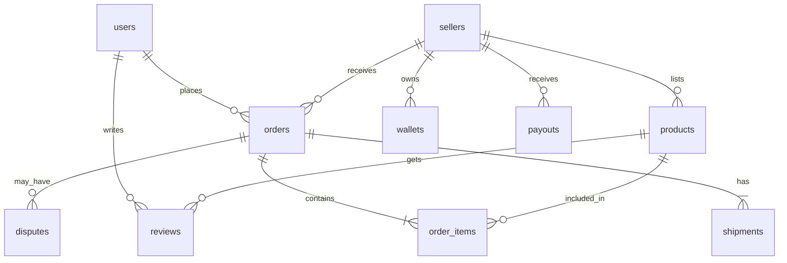
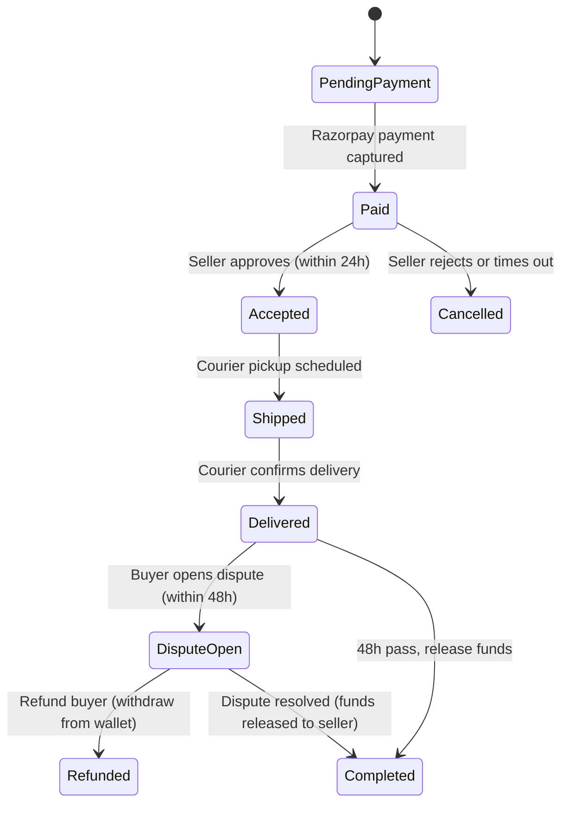

# Technical Product Requirements Document (TPRD) – Social-Commerce Thrift Marketplace

## Executive Summary  
This document provides a **developer-oriented technical PRD** for building a Shopify-like social-commerce platform for Instagram thrift sellers in India. It covers system architecture, tech stack, data design, APIs, payment & escrow flows, logistics integration, authentication, security, fraud detection, DevOps, UI/UX considerations, edge cases, and a 3–4 week MVP roadmap. All design decisions align with the following constraints: Next.js (frontend), Node.js/NestJS (backend), PostgreSQL (DB), Redis (cache/locks/queues), Docker with AWS/GCP hosting, Razorpay for payments, Shiprocket for shipping, OTP/Google login, no COD in MVP, 5% commission (paid by buyers), 48h escrow hold, seller wallet with manual payouts, return flows, and basic AI fraud scoring.
Key platform facts:

- **Target users:** Instagram thrift clothing sellers in India (initial MVP)  
- **Store model:** Each seller gets an independent online store (e.g. `loopy.com/{sellername}`) with multi-tenant architecture. (Full marketplace evolves later.)  
- **Payments:** Handled via Razorpay (PG and Payouts). Buyers pay platform; funds are held ~48h, then released to sellers after dispute window. Sellers need KYC (PAN/Aadhaar/bank) and are manually approved. Seller payouts use Razorpay Contacts/Fund Accounts.  
- **Revenue:** Platform takes ~5% commission on each order (added to buyer cost). No subscription fees initially.  
- **Shipping:** Integrate Shiprocket (multiple courier partners) and allow manual shipping setup. No COD in MVP. Buyers prepay shipping, or seller configures charges. Returns with pickup must be supported (RTO and refunds).  
- **Escrow/Trust:** Use an escrow-like hold (via platform wallet) for 48h; buyer can dispute within 48h of delivery. Seller money is then paid out manually. Build buyer trust via ratings, unboxing-photo proof, and seller verification badges.  
- **Tech stack:** React/Next.js (TypeScript) frontend (mobile-first, PWA), NestJS/Node.js backend, PostgreSQL, Redis, Docker, AWS/GCP, CI/CD pipelines.  
- **Scale/Metrics:** Expect ~15 sellers and 100–500 monthly orders in MVP; plan to scale orders to thousands/month next year.  

All sections below assume **strict developer focus**: concrete modules, schemas, endpoints, diagrams, and actionable notes. Citations link to official docs or industry references where applicable.

---

## 1. Competitive Landscape

| Platform          | Commission                   | Seller Payout         | Key Features                             |
|-------------------|------------------------------|-----------------------|------------------------------------------|
| **DM2Buy** | 0% (no commission)           | Next bank day (via Cashfree) | Instagram-focus, free, unlimited listings, order management, basic themes, **no coding** needed, **COD (Pro only)**, custom domain (paid) |
| **Loopy (ours)**  | ~5% (added to buyer’s price) | Hold 48h, manual payout | Seller-owned stores, integrated escrow, logistics, fraud scoring, seller KYC, rating system, Shopify-like UX |
| **ZThrifts/Jettrips** (India’s large thrift marketplace) | Not public (likely higher commission) | Not disclosed         | Curated vintage/thrift, quality-checked items, verified sellers |
| **Other (e.g. Obizee, Mallplaza)** | Varies (1–5%+)             | Varies                | Multichannel commerce (Instagram, website, WhatsApp), custom stores, sometimes subscription; typically *pay-to-listen* |
| **Instagram Shopping** | N/A (free platform)         | N/A (direct IG checkout or DM) | No direct Indian payment integration yet; upcoming Shops features worldwide. |

- **Insights:** DM2Buy’s 0% commission and next-day payout model highlights user expectations: fast payments and no fees. Our platform must **differentiate** via value-added escrow/logistics/trust, balancing a modest commission.  
- **Positioning:** We blend DM2Buy’s easy onboarding with Jettrips’ trust infrastructure (verified sellers, quality checks) to create “Instagram thrift sellers’ Shopify” while leveraging **marketplace escrow/logistics**.  

---

## 2. System Architecture

We recommend a **modular monolith** architecture (single codebase with clearly separated modules), paving an eventual transition to microservices. Key reasons: small team (2 devs + 1 DevOps), faster initial development, simpler deployment. Internally structure by domain (e.g. Auth, Seller, Orders) with NestJS modules.

High-level components:
```
Front-end (Next.js app)  <-->  API (NestJS HTTP server)  <-->  Database (Postgres)
                                        |
                                 Redis (cache/locks/queues)
                                        |
                                 External APIs (Razorpay, Shiprocket)
```

```mermaid
flowchart LR
    subgraph Frontend
        UI[Buyer/Seller/Web UI (Next.js)]
    end
    subgraph Backend [Node.js (NestJS) Server]
        AuthSvc[Auth Module]
        UserSvc[User/Seller Module]
        ProdSvc[Product Module]
        OrderSvc[Order Module]
        PaySvc[Payment/Escrow Module]
        ShipSvc[Shipping Module]
        NotifSvc[Notification Module]
        AdminSvc[Admin & Fraud Module]
    end
    subgraph Data
        PG[(PostgreSQL)]
        Redis[(Redis)]
        S3[(Object Storage)]
    end
    UI -->|HTTPS JSON| AuthSvc
    UI -->|HTTPS JSON| UserSvc
    UI -->|HTTPS JSON| ProdSvc
    UI -->|HTTPS JSON| OrderSvc
    UI -->|HTTPS JSON| AdminSvc
    OrderSvc -->|calls| PaySvc
    OrderSvc -->|calls| ShipSvc
    OrderSvc -->|reads/writes| PG
    PaySvc -->|reads/writes| PG
    ShipSvc -->|reads/writes| PG
    AdminSvc -->|reads/writes| PG
    AuthSvc -->|reads/writes| PG
    UserSvc -->|reads/writes| PG
    Redis -- locks/queues --> OrderSvc
    Redis -- session/cache --> AuthSvc
    ShipSvc -->|API calls| Shiprocket[Shiprocket API]
    PaySvc -->|API calls| Razorpay[Razorpay API]
    NotifSvc -->|emails/sms| (SMTP/OTP Gateway)
    PG -->|store media| S3
```

### 2.1. API Gateway and Modules  
All client requests (storefront or dashboard) hit a unified NestJS HTTP server (could later split into subservices). Use **API controllers** for each domain. Employ middleware for logging, auth guard (JWT via cookies/local storage), and RBAC guards. 

Key modules (services/controllers):  
- **AuthService:** OTP login (via phone/email), Google OAuth, JWT issuance/refresh.  
- **User/Seller Service:** User profile, roles, KYC documents, store details.  
- **Product/Store Service:** Seller store catalog, product CRUD, inventory management.  
- **Order Service:** Cart, order creation, status updates (Pending, Accepted, Shipped, Delivered, etc).  
- **Payment/Escrow Service:** Razorpay integration, order capture, escrow hold logic, wallet management.  
- **Shipping Service:** Shiprocket integration: create shipments, schedule pickup, track, label retrieval.  
- **Notification Service:** Email/WhatsApp/Push (order confirmations, shipping updates).  
- **Admin Service:** Manage seller approvals, dispute resolution, analytics dashboards.  
- **Fraud/Trust Service:** Risk scoring, logs events, user trust scores (internal use).  
- **Analytics Service (optional):** Basic metrics (e.g. total sales, top sellers) – could be part of Admin Service.  

#### Event-Driven Design  
Within the backend, use **events/queues** for asynchronous flows. For example, after payment capture, emit an `OrderPaid` event; a consumer creates shipping orders and schedules payout. Use Redis (with Bull or similar) for job queueing (e.g. scheduling tasks, webhooks).  

#### Scalability & Future-Proofing  
- **Modular separation:** Keep code modular to split into microservices later if needed (e.g. separate Payment or Order service).  
- **Stateless services:** Node app containers will be stateless (session kept in Redis if needed) to allow horizontal scaling.  
- **Caching:** Use Redis for caching common reads (e.g. categories) and for hot data (e.g. active carts).  
- **CDN/media:** Serve product images via S3 + CDN (Cloudfront) with signed URLs. Store images in S3 buckets; use Next.js image optimization.  
- **Rate limiting & Throttling:** Apply to API (NestJS Throttler) to protect against abuse.  
- **API versioning:** Prefix APIs with version (e.g. `/api/v1/...`) to allow future changes.

---

## 3. Frontend (Next.js) Architecture

The frontend will be a **Next.js (TypeScript)** codebase with two main sections:  
- **Storefront (Buyer-facing):** Public pages showing seller’s brand, product listings, product pages, cart, checkout, order tracking, user profile.  
- **Dashboard (Seller/Admin):** Authenticated seller portal: manage products, orders, payouts, analytics; and an admin interface (could be separate route) for manual approvals and dispute handling.

Key points:  
- **Routing:** Use Next.js file-based routing. Example:  
  - `/s/[sellerUsername]` → Seller’s store homepage (server-rendered or static).  
  - `/s/[sellerUsername]/p/[productSlug]` → Product page.  
  - `/shop`, `/cart`, `/checkout` → Buyer flows.  
  - `/seller/dashboard`, `/seller/products`, `/seller/orders` → Seller dashboard (protected routes).  
  - `/admin/...` → Admin panel (protected, likely separate build or sub-route).  
- **Rendering Strategy:**  
  - **Storefront:** ISR (Incremental Static Regeneration) or SSR for SEO friendliness (buyer-store pages should be crawlable). For up-to-date inventory, fallback to SSR for critical flows like checkout.  
  - **Dashboard:** Client-side or SSR (requires auth), but can be CSR-heavy since private. Use auth checks.  
- **State Management:** Use React Context or Zustand/Redux for global state (cart, user, etc). Keep it minimal (cart = global, auth = context).  
- **Styling:** Tailwind CSS for rapid styling, optionally with a design system (e.g. Headless UI components).  
- **API Integration:** Wrapper service for REST calls (axios). Handle auth (attach JWT).  
- **Mobile-First & Responsive:** All pages responsive; CSS grids and flex layouts, hamburger menu for mobile.  
- **Forms & Validation:** Use React Hook Form + Yup for product upload forms, signup/login (with OTP field).  
- **Error/Loading States:** Show spinners on API loads, validation errors near fields.  
- **SEO:** Seller pages should include meta tags (OpenGraph, JSON-LD for products).  
- **PWA Ready:** Enable service worker (Next PWA) to allow installable app (optional).  
- **Folder Structure (example):**  
  ```
  /pages
    /_app.tsx, /_document.tsx
    /index.tsx (landing)
    /login.tsx, /otp-verify.tsx
    /seller/dashboard.tsx, /seller/orders.tsx, /seller/products.tsx
    /s/[sellerUsername]/index.tsx (storefront home)
    /s/[sellerUsername]/product/[id].tsx
    ...
  /components (common UI components: Navbar, Footer, ProductCard, etc)
  /lib (API client wrappers)
  /contexts (AuthContext, CartContext)
  /styles (global.css, tailwind config)
  /hooks (custom hooks)
  /assets (images, icons)
  ```
- **UI Libraries:** Possibly use a component library (Chakra UI, Material, or a custom Tailwind kit). Emphasize simple, clean thrift aesthetic.  
- **Authentication:** On login, store JWT in HttpOnly cookie or localStorage; use NextAuth.js for Google/OAuth if desired. Protect dashboard routes with auth check.  
- **Error Boundaries:** Use React error boundaries for critical components.  
- **Testing:** Jest + React Testing Library for key components (not an MVP priority, but recommended if time).  

---

## 4. Backend (NestJS) Modules & Services

The backend will be developed in **Node.js with NestJS** (allows modularity and TypeScript). Use the controller/service/repository pattern. Key modules and their responsibilities:

- **Auth Module:**  
  - **Controllers:** `/auth/login`, `/auth/verify-otp`, `/auth/google`, `/auth/refresh-token`.  
  - **Services:** OTP generation/verification (via Twilio/OTP API), Google OAuth, JWT token issuance (access + refresh).  
  - **DB:** `Users` table (shared with buyers/sellers), storing phone/email, hashed password (if using PW), role (Buyer/Seller/Admin), refresh tokens.  
  - **Notes:** Temporary OTP codes in Redis with short TTL. Block disposable emails (check against list). Enforce strong JWT expiry (~15m) with refresh tokens.

- **User/Seller Module:**  
  - **Controllers:** `/users/me`, `/sellers/me`, `/sellers/kyc`, `/sellers/register`.  
  - **Services:** Profile management, KYC document upload, store settings (name, bio, logo, shipping rates).  
  - **DB:** `Sellers` table (extends Users or separate), KYC docs storage, `Stores` table (1:1 with Sellers) with subdomain/username, metadata (banner, description).  
  - **Flow:** On registration, create user as Seller (status = “Pending”). Seller uploads PAN, Aadhaar, bank details via `/sellers/kyc`. Admin reviews and approves. Use AWS S3 to store docs, with signed upload URLs.  
  - **Validation:** Verify PAN format, Aadhaar length, bank IFSC via Razorpay bank API if possible.

- **Product Module:**  
  - **Controllers:** `/products` (CRUD), `/products/:id`.  
  - **Services:** Create/update product, assign to seller’s store, manage inventory.  
  - **DB:** `Products` table (id, seller_id, title, description, price, condition, brand, category, images, etc), `Inventory` table (product_id, quantity). For single-qty items, quantity starts 1 and is decremented.  
  - **Logic:** On product creation, thumbnail generation (server-side or on upload via S3). Ensure fields: title, images, condition, size, price, optional brand/category. Mark fields mandatory as per UX needs.  
  - **Inventory Locking:** Use Redis locks or DB transactions (SELECT FOR UPDATE) when orders are placed to decrement quantity safely, preventing oversell. (For unique items, check quantity >=1 before confirming payment.)

- **Order/Cart Module:**  
  - **Controllers:** `/cart` (CRUD items), `/orders/checkout`, `/orders/:id`.  
  - **Services:** Cart management (in-memory or DB), Order creation after payment, Order status transitions.  
  - **DB:** `Carts` (user/cart_id), `CartItems` (cart_id, product_id, quantity), `Orders` (id, user_id, seller_id, total_amount, status, timestamps), `OrderItems` (order_id, product_id, qty, unit_price).  
  - **Checkout Flow:**  
    1. Buyer initiates checkout: send cart to backend; reserve inventory (e.g. lock in DB or Redis).  
    2. Create Razorpay Order (amount = cart total + shipping). Return order_id and key to frontend.  
    3. Frontend captures payment via Razorpay Checkout.  
    4. Razorpay callback/webhook → backend `PaymentService` verifies signature, marks order as *Paid*, updates `Orders`.  
    5. Emit `OrderCreated` event → triggers inventory commit and funds-hold logic.  
  - **Order Status:** e.g. `PendingPayment`, `PaymentSuccess`, `Accepted`, `Shipped`, `Delivered`, `Completed`, `Cancelled`, `Disputed`. Use an `enum`.  

- **Payment/Escrow Module:**  
  - **Controllers:** Webhooks (`/payment/webhook`), Payouts (`/payments/payout-request`).  
  - **Services:** Integrate Razorpay for payments and payouts. Hold funds in seller wallet for 48h.  
  - **Flow:**  
    - On **order payment success**, create or update seller’s wallet balance entry (in DB) but do not auto-payout until dispute window.  
    - Use a scheduled job (or manual trigger) to release payments after 48h from delivery (only if no dispute). This may call Razorpay Payout API.  
    - If **refund/dispute**, refund buyer via Razorpay and deduct from seller’s balance (or platform covers if allowed).  
  - **Razorpay Integration:**  
    - **Create Order:** `POST /v1/orders` with `amount`, `currency`, `receipt`, and `[split_info]` (if using Routes for commissions).  
    - **Payment Capture:** via callback or webhook. Verify signature (HMAC) for security.  
    - **Create Contact/Fund Account:** For each seller, upon signup: create Razorpay Contact and Fund Account with their bank details. Store `contact_id` and `fund_account_id` in `Sellers`.  
    - **Payout:** Use `POST /v1/payouts` to transfer funds to seller’s bank via the fund account. Mark payout status in DB.  
    - **Idempotency:** Use idempotency keys on payouts to avoid double transfers.  
  - **Ledger:** Maintain `Wallets` and `Payouts` tables. `Wallets(seller_id,balance)`. On successful payment, `balance += amount-commission`. On payout, create `Payout` record (id, seller_id, amount, status).  
  - **Commission:** Platform commission stored separately or subtracted on payout.  

- **Shipping (Logistics) Module:**  
  - **Controllers:** `/shipments` (create & track), webhooks for status updates.  
  - **Services:** Integrate Shiprocket APIs.  
  - **Flow:**  
    1. After seller **accepts** an order, seller requests shipment: backend calls Shiprocket to `order_create` (with origin/destination, weight, COD value=0, etc) to get a Shiprocket Order ID.  
    2. Call `order_ship` to assign courier and generate AWB.  
    3. Schedule pickup with `order_pickup_schedule`.  
    4. Save AWB/tracking info in DB (`Shipments` table).  
    5. Listen to Shiprocket webhooks for tracking updates (if available) and update order status. Also allow buyer to view tracking from our site.  
    6. In case seller prefers manual shipping initially, allow them to enter tracking number manually.  
  - **DB:** `Shipments` table (order_id, carrier, awb, status, pickup_date, delivered_date, etc).  
  - **Returns:** Create Shiprocket return label via `order_ship` with reverse logistics (if supported) or guide manual pickup. Refund logic integrated with return event.  
  - **Cancellation/Delays:** If courier fails, update order as delayed; possibly auto-refund if not deliverable.  

- **Notification Module:**  
  - **Channels:** Email (via SES/Mailgun), SMS/WhatsApp (Twilio or WhatsApp Business API), Push (optional).  
  - **Triggers:** Order placed, payment confirmed, order accepted, shipment AWB created, out-for-delivery, delivered, payout released, dispute raised.  
  - **Templating:** Use transactional templates with dynamic data (must be stored in DB/email service).  
  - **Retries:** For failed sends, retry logic via queue.  

- **Admin Module:**  
  - **Controllers:** `/admin/sellers`, `/admin/disputes`, `/admin/reports`.  
  - **Functionality:**  
    - Review and approve/reject seller applications after verifying KYC docs.  
    - Monitor disputes raised by buyers (refund requests, missing item).  
    - View platform analytics (total GMV, active sellers, flagged transactions).  
  - **DB:** Admin role in Users table. Possibly `Disputes` table to log issues.  

- **Analytics Module (optional in MVP):**  
  - Collect key metrics (orders/day, sales volume, payment success rate). Could use simple Cron to aggregate daily stats. Future: integrate Google Analytics or internal dashboard.

### NestJS Patterns & Practices  
- Use **DTOs and class-validator** for request/response schemas.  
- Employ **Passport.js** or NestJS AuthGuard for JWT/OAuth strategies.  
- **Version APIs** (v1).  
- Implement **Global pipes/filters** for input validation and exception handling.  
- **CORS** setup for frontend domain, and IP allowlist for Razorpay APIs.  
- **Logging:** Use NestJS Logger or Winston; log at least request ID, timestamps, user IDs.  
- **Queues/Tasks:** Use Bull (Redis) for background jobs (e.g. payout scheduler, email sending).  
- **Testing:** Write unit tests for critical services; e2e tests with Jest (if time).  

---

## 5. Database Design (PostgreSQL)

We use a **relational schema** with normalized tables. Key tables (with example columns and relations):

| Table            | Columns (key fields)                                                   | Notes/Relations                                       |
|------------------|-----------------------------------------------------------------------|-------------------------------------------------------|
| **users**        | id (PK), name, email, phone, password_hash, role (buyer/seller/admin), created_at, updated_at | All user accounts. `role` enum. Email/phone unique.  |
| **sellers**      | id (PK, FK→users.id), store_name, username (unique), description, banner_url, logo_url, kyc_status, contact_id (Razorpay), fund_account_id, created_at, updated_at | One-to-one with users (role=seller). `kyc_status`: pending/approved/rejected. |
| **products**     | id, seller_id (FK→sellers), title, description, price, condition, size, brand, category_id, images (JSON array of URLs), quantity, is_active, created_at, updated_at | Each product belongs to a seller. `quantity` handles inventory. |
| **categories**   | id, name                                                         | For product browsing/filter (MVP: optional).         |
| **carts**        | id, user_id (FK→users), created_at, updated_at                     | One cart per buyer (or session).                      |
| **cart_items**   | id, cart_id (FK→carts), product_id (FK→products), quantity         |                                                 |
| **orders**       | id, buyer_id (FK→users), seller_id (FK→sellers), total_amount, commission_amount, shipping_charge, status, payment_id (Razorpay), created_at, updated_at | `status` enum: PendingPayment, Paid, Accepted, Shipped, Delivered, Completed, Cancelled, Disputed. |
| **order_items**  | id, order_id (FK→orders), product_id (FK→products), unit_price, quantity, subtotal |                                        |
| **payments**     | id, order_id (FK), razorpay_order_id, razorpay_payment_id, method, amount, status, paid_at | Records Razorpay payment.                             |
| **wallets**      | id, seller_id (FK→sellers), balance                                     | Running balance held for seller (escrow).              |
| **payouts**      | id, seller_id, amount, status, request_date, paid_date, remarks         | Each payout transaction.                              |
| **shipments**    | id, order_id, courier_name, awb_number, pickup_date, delivery_date, status | Links to orders. `status` updated from Shiprocket.    |
| **reviews**      | id, order_id, product_id, rating (1-5), comment, images (URLs), created_at | Buyer reviews after delivery.                          |
| **disputes**     | id, order_id, buyer_id, seller_id, issue_type, description, status, created_at, resolved_at | Buyer can open a dispute. Admin resolves it.         |
| **sessions**     | id, user_id, refresh_token, expires_at                                | For refresh token management.                         |

**ER Diagram (simplified):**  


### Key Constraints & Indexes  
- **PKs and FKs** as above.  
- **Unique:** `users.email`, `users.phone`, `sellers.username`.  
- **Indexes:** On `products.seller_id`, `orders.seller_id`, `orders.buyer_id`, `payments.razorpay_order_id`.  
- **Transactions:** Use SQL transactions for multi-step flows (e.g. checkout: decrease inventory + create order). Set **REPEATABLE READ** isolation for consistency.  
- **Inventory Locking:** For single-quantity products, apply `SELECT ... FOR UPDATE` when creating order; if `quantity < requested`, abort. Alternatively, use Redis locks keyed by product ID during checkout. After payment success, decrement `products.quantity` in same transaction as marking order.  
- **Data Retention:** Archive old orders (>1 year) or use partitioning by date (if scale requires).  
- **Audit Logs:** Optionally, maintain `audit_logs` table for actions (order status changes, payouts).  
- **KYC Data:** Store PAN/Aadhaar hashes only or encrypted; do NOT store full sensitive info in clear text (for compliance).  

---

## 6. API Design

All APIs are RESTful (JSON) under a versioned base (e.g. `/api/v1`). Use Bearer JWT for protected routes. Example endpoints (not exhaustive):

| Resource        | HTTP Method | Endpoint                              | Auth/Params                | Request Body (JSON)                            | Response                    | Notes/Errors                                               |
|-----------------|-------------|---------------------------------------|----------------------------|-----------------------------------------------|-----------------------------|-----------------------------------------------------------|
| **Auth**        | POST        | `/api/v1/auth/login`                  | (public)                   | `{ phone: string }` or `{ email: string }`     | `{ login_id: string }`      | Sends OTP. Validate format.                                |
| **Auth**        | POST        | `/api/v1/auth/verify`                 | (public)                   | `{ login_id: string, otp: string }`            | `{ token: string, refresh: string }` | 2FA login returns JWT.                                    |
| **Auth**        | POST        | `/api/v1/auth/refresh`                | Authorization: Bearer (refresh token) | `{ refresh_token: string }`            | `{ token: string }`          | Refreshes access token.                                   |
| **Seller**      | POST        | `/api/v1/sellers/register`            | (public)                   | `{ name, phone, email, password, username }`   | `{ seller_id }`             | Creates seller account (pending approval). Validate unique username. |
| **Seller**      | POST        | `/api/v1/sellers/kyc`                 | Seller JWT                 | `{ pan, aadhaar, bank_account, ifsc } + files` | `{ status: string }`        | Upload KYC docs (multipart). Status: pending/approved.    |
| **Seller**      | GET         | `/api/v1/sellers/me`                 | Seller JWT                 | None                                          | `{ seller_profile }`        | View own profile.                                         |
| **Products**    | GET         | `/api/v1/sellers/{sid}/products`      | (public)                   | None                                          | `{ products: [...] }`       | List a seller’s products. Returns 404 if seller suspended. |
| **Products**    | POST        | `/api/v1/sellers/me/products`         | Seller JWT                 | `{ title, description, price, condition, size, images, quantity }` | `{ product_id }` | Create new product (seller_id inferred). Mandatory fields enforced. |
| **Products**    | PUT         | `/api/v1/sellers/me/products/{pid}`   | Seller JWT                 | `{ title?, price?, ... }`                     | `{ success }`               | Edit product. Only owner can.                             |
| **Cart**        | GET         | `/api/v1/cart`                        | Buyer JWT                  | None                                          | `{ items: [...] }`         | Get current cart.                                        |
| **Cart**        | POST        | `/api/v1/cart/items`                  | Buyer JWT                  | `{ product_id, quantity }`                   | `{ cart_item_id }`         | Add item to cart. Check inventory availability.          |
| **Orders**      | POST        | `/api/v1/orders/checkout`             | Buyer JWT                  | `{ shipping_address_id }`                     | `{ razorpay_order_id, amount }` | Creates local Order (Pending) and Razorpay order. Returns payment details. |
| **Orders**      | POST        | `/api/v1/orders/confirm`              | Buyer JWT                 | `{ payment_id, order_id, signature }`         | `{ status: "success", order_id }` | Verifies payment signature, finalizes order as Paid. |
| **Orders**      | GET         | `/api/v1/orders/{id}`                 | Buyer/Seller/Admin JWT (role-based) | None                                     | `{ order_details }`        | Get order info (owner or involved party).                |
| **Orders**      | POST        | `/api/v1/orders/{id}/accept`          | Seller JWT                | None                                          | `{ status: "accepted" }`    | Seller accepts order. (Lock-in.)                         |
| **Orders**      | POST        | `/api/v1/orders/{id}/ship`            | Seller JWT                | `{ pickup_date }`                             | `{ tracking_number }`       | Initiates Shiprocket shipment.                           |
| **Orders**      | POST        | `/api/v1/orders/{id}/delivered`       | Admin/Auto (webhook)      | None                                          | `{ status: "delivered" }`   | Mark delivered (triggered by courier webhook or admin).  |
| **Reviews**     | POST        | `/api/v1/orders/{id}/reviews`         | Buyer JWT                 | `{ rating, comment, images[] }`               | `{ review_id }`             | After delivered.                                        |
| **Payouts**     | GET         | `/api/v1/seller/wallet`              | Seller JWT                | None                                          | `{ balance, pending, paid }` | Seller wallet info.                                     |
| **Payouts**     | POST        | `/api/v1/seller/payouts`             | Seller JWT                | `{ amount }`                                  | `{ status: "pending" }`     | Request payout (admin-review or auto).                  |
| **Admin**       | GET         | `/api/v1/admin/sellers`               | Admin JWT                 | None                                          | `{ pending_sellers: [...] }` | List sellers pending KYC approval.                       |
| **Admin**       | POST        | `/api/v1/admin/sellers/{sid}/approve` | Admin JWT                 | `{ approved: boolean }`                       | `{ status }`                | Approve or reject seller KYC.                            |
| **Webhooks**    | POST        | `/api/v1/payment/webhook`             | Razorpay signature header | Raw JSON (Razorpay payload)                   | `200 OK`                    | Handles payment capture, refunds, and transfers.        |
| **Webhooks**    | POST        | `/api/v1/shipment/webhook`            | Shiprocket              | Raw JSON (tracking event)                     | `200 OK`                    | Updates shipment status in system.                      |

**Security & Best Practices:** Use HTTPS. Validate all inputs (e.g. price > 0). Follow standard HTTP status codes (400 for invalid input, 401/403 for auth issues, 404 for not found). Include error messages in JSON. Implement idempotency for payment and shipment webhooks. For example, if Razorpay resend webhook, handle duplicates (Razorpay provides `payment_id` to detect existing record).

*Citations:* Shiprocket endpoints (`order_create`, `order_ship`, `order_pickup_schedule`, `order_cancel`) are documented via Shiprocket’s API. Razorpay Contacts/Fund Accounts required for seller payouts are in their docs.

---

## 7. Payment & Escrow Workflow

We implement an **escrow-like payment flow** using Razorpay and a platform wallet:

1. **Order Creation:** Buyer places items in cart and clicks “Pay”. Backend creates a Razorpay Order (`/v1/orders`) with full amount (including shipping, platform commission).  
2. **Payment:** Frontend uses Razorpay Checkout with the order ID. Buyer completes payment (UPI/credit/debit/netbanking).  
3. **Payment Confirmation:** Razorpay sends a callback/webhook to `/payment/webhook` with `order_id`, `payment_id`, `signature`. Backend verifies HMAC signature to ensure authenticity. On success, mark our `orders.status = Paid`.  
4. **Funds Holding:** The payment amount lands in the platform’s Razorpay account. We **immediately** credit the seller’s internal wallet (`wallets.balance += seller_share`) but do NOT transfer to bank yet. Platform’s commission portion is retained. This mimics escrow hold.  
5. **Order Acceptance:** Seller has ~24h to accept. If seller rejects or ignores, buyer is refunded via Razorpay, and inventory is released. Platform may incur a reversal fee.  
6. **Shipping:** Once seller accepts, seller triggers shipping (via Shiprocket integration).  
7. **Delivery & Dispute Window:** After courier marks delivered (via webhook or buyer confirmation), a **48h dispute window** begins (display notice “Funds will be released after 48h if no issues”). Buyer can raise a dispute/refund within this window. If dispute arises, platform investigates: if valid, refund buyer and deduct from seller’s wallet (or platform covers for first few months).  
8. **Payout Release:** If 48h pass with no dispute, platform initiates a Razorpay Payout to seller’s bank (using their Fund Account). Mark `payouts.status = Paid`.  
9. **Settlement:** Seller sees updated wallet (which is now 0 or updated balance). Admin/DevOps can manually trigger payouts in this MVP stage (no auto-schedule), but logs record each payout request.

**Razorpay Integration Details:**  
- **Create Contact/Fund Account:** On seller KYC approval, call Razorpay’s Contacts API (`POST /v1/contacts`) to get `contact_id`, then `POST /v1/fund_accounts` to save bank details. Save these IDs for payouts.  
- **Create Order API:** `POST /v1/orders` with `{amount, currency, receipt}`. Use NestJS to wrap Razorpay SDK or direct HTTP.  
- **Webhook Handling:** Razorpay sends JSON events. We must verify `X-Razorpay-Signature`. Use NestJS `@RawBody()` and a secret key. On `payment.captured`, update order.  
- **Payout API:** `POST /v1/payouts` with `{account_number (our provider acct), fund_account_id: seller’s, amount, currency}`. Razorpay will disburse via NEFT/RTGS; optionally support UPI in future.  
- **Refund API:** `POST /v1/payments/:id/refund` for full/partial refunds.  
- **Edge Cases:** If Razorpay payment fails, mark order cancelled. If payout fails (bank rejects), log and alert. Use Razorpay’s Idempotency-Key header to avoid double payments on retries.

**State Diagram (Order/Escrow):**  

This captures escrow hold: **Delivered** state triggers a timer. Only on transition to **Completed** do we move funds to seller. Reference RBI’s rule that payouts to merchants occur only after product delivery, and aggregator holds funds otherwise.

---

## 8. Shipping & Logistics

### Integration  
Use **Shiprocket API** (requiring prior account and API keys). According to Shiprocket’s docs (Postman workspace), key endpoints include:  
- **Order Create:** `POST /v1/external/orders/create` (`order_create`) – register shipment details (weight, pincode, COD amount).  
- **Order Ship:** `POST /v1/external/orders/ship` (`order_ship`) – assign courier and generate AWB.  
- **Pickup Schedule:** `POST /v1/external/orders/pickup/schedule` (`order_pickup_schedule`).  
- **Generate Label:** `GET /v1/external/orders/label` (`generate_shipment_label`).  
- **Track Order:** `GET /v1/external/courier/track` or receive webhooks for AWB updates.  
- **Cancel Order:** `POST /v1/external/orders/cancel` (if needed).  

### Workflow  
1. **Seller Requests Shipment:** In seller dashboard, the seller clicks “Ship Order”. Backend calls Shiprocket `order_create` with JSON (order_id, buyer address, weight, total_amount as COD=0). Shiprocket returns `shiprocket_order_id`.  
2. **Assign Courier:** Immediately call `order_ship` with `shiprocket_order_id` to pick a courier automatically (or allow seller to choose). This returns an AWB number. Save `awb_number` in `shipments`.  
3. **Schedule Pickup:** Call `order_pickup_schedule` for next-day pickup. Confirm pickup via UI.  
4. **Label:** Call `generate_shipment_label` to get PDF label, allow seller to download it. Attach label to parcel.  
5. **Tracking:** Use Shiprocket’s webhooks (or poll `order_track`) to update delivery status. When `sr_status_label` = “Delivered”, mark order delivered.  
6. **Manual Option:** For MVP, allow seller to enter courier/awb if using their own logistics (manual entry).  
7. **Returns:** If buyer requests return, create a reverse shipment via Shiprocket if supported (or manual pickup by courier). Then process refund.  

### Status Lifecycle  
A shipment moves through states: Created → Pickup Scheduled → In Transit → Out for Delivery → Delivered. Each update should be captured. Provide buyer a “Track Order” UI using AWB. Example status from docs: `"In Transit - Bag Received at Facility"`.

### Edge Cases  
- **Shipping Failures:** If Shiprocket cannot find courier (error on `order_ship`), notify seller to retry or use manual.  
- **Failed Delivery:** If courier marks unable-to-deliver, trigger refund flow or manual intervention.  
- **Address Issues:** Validate pincodes and addresses (maybe use Shiprocket’s serviceable pincode API) before creating order.  
- **AWB Conflicts:** Ensure AWB is unique per order.  
- **Webhook Retries:** Idempotent handling if same tracking update arrives multiple times.

---

## 9. Authentication & Security

- **JWT Auth:** Issue access tokens (~15min expiry) and refresh tokens (~7d). Store refresh tokens hashed in DB. Protect routes with `AuthGuard` and roles (`Buyer`, `Seller`, `Admin`). Use NestJS `@UseGuards()` and custom decorators.  
- **Login Methods:**  
  - **OTP Login:** Send OTP via SMS/email. Use Redis to store OTPs (TTL ~5min). Upon correct OTP, create JWT.  
  - **Google OAuth:** Use Passport with Google strategy. Link Google ID to `users` record.  
  - **Email/Password:** (Optional) For admin or if adding password login. Passwords hashed with bcrypt (salt ≥10 rounds).  
- **RBAC:** Define roles. Only sellers can access `/seller` APIs, only admins access `/admin`. Buyers can only see their own data. Use guards on controllers.  
- **Sensitive Storage:**  
  - **Environment Secrets:** JWT secret, Razorpay keys, Shiprocket keys, DB credentials in environment (Docker secrets or AWS Secrets Manager).  
  - **File Storage:** KYC docs and product images in S3. Signed upload and download URLs. Set S3 bucket policies to private; serve via backend or CDN with proper caching headers.  
- **RBI Compliance:** As a PA, we do not hold buyer funds permanently. We maintain them in escrow (wallet) no longer than necessary. KYC: collect and verify PAN, Aadhaar, address proof. *Do not* allow sellers to start accepting payments until KYC is approved.  
- **Data Protection:**  
  - **PII:** Encrypt or hash sensitive PII (Aadhaar, account numbers) at rest.  
  - **PCI DSS:** Offload all payment entry to Razorpay (iFrames or Checkout) so card data never hits our servers.  
  - **CSP/Headers:** Set Content Security Policy, HSTS, etc.  
  - **Rate Limiting:** Apply per-IP and per-user rate limits to APIs, especially login (prevent OTP abuse).  
  - **Validation:** Strictly validate all inputs to prevent SQL injection, XSS. Use parameterized queries (ORM), class-validator, NestJS pipes.  

*Citations:* Razorpay advises allowlisting IPs for payout APIs, which will be noted in deployment. RBI mandates merchant KYC and escrow rules, hence strict seller onboarding.

---

## 10. Fraud & Trust Mechanisms

We implement **lightweight rule-based fraud detection** to flag suspicious behavior:

- **Seller Trust Score (hidden):** Internally maintain a score based on factors: time since signup, completeness of profile, KYC status, dispute ratio, review ratings, etc. High-trust sellers get badges.  
- **Buyer Risk Checks:** Simple rules such as: very new accounts making large orders, mismatched delivery address (e.g. prepaid card to distant location). Flag for manual review.  
- **Order Velocity:** Limit order frequency per account and per payment method (e.g. 3 orders/day).  
- **Location/Age Mismatch:** E.g. if seller IP is not India, block.  
- **Image Fraud:** For product images, optionally run a basic check (e.g. reverse image search via Google Vision API to detect duplicates, or AI to detect if adult content). (MVP skip heavy AI.)  
- **Suspicious Patterns:** Monitor chargeback rates or repeated cancellations; maintain logs for admin.  
- **Dispute Evidence:** Require buyer to upload photo (of received item) when opening dispute. Display dispute count to admin.  
- **Manual Review:** Admin interface to view flagged orders (with reasons).  

We will not build complex ML in MVP. However, keep extensibility (e.g. modularize fraud rules service). Provide an endpoint for cron-based fraud scoring (update nightly). Log all triggered rules for audit.

*Citations:* Industry platforms use escrow to **enhance buyer trust**. We follow suit by displaying disclaimers (“2-day safety hold”) and verifying sellers before approval (similar to Jettrips’ QC model).

---

## 11. DevOps & Infrastructure

- **Containers:** Dockerize backend and frontend. Use multi-stage builds.  
- **Environment:** Host on AWS (recommended) or GCP. Key services:  
  - **Compute:** ECS/Fargate or EKS (for Docker containers), or EC2 + Docker.  
  - **Database:** Amazon RDS (PostgreSQL) with Multi-AZ.  
  - **Redis:** AWS ElastiCache Redis cluster.  
  - **Storage:** S3 for images, and CloudFront CDN for speed.  
  - **Domains:** Custom domains per seller (CNAME or path). Use wildcard certs (Let’s Encrypt or AWS ACM).  
- **CI/CD:** GitHub Actions/GitLab CI to build/test images and deploy to staging/production. Automated tests before merge.  
- **Infrastructure as Code:** Terraform or AWS CloudFormation for reproducibility.  
- **Logging & Monitoring:**  
  - Use EFK/CloudWatch for logs. Log API requests/responses (non-sensitive data).  
  - Set up alerting for 5xx errors, high latency.  
  - Monitor DB connections, CPU, and queue backlogs.  
- **Backup:** Daily snapshots of Postgres.  
- **Scaling:** Define autoscaling based on CPU or request volume. Given low initial traffic, use minimal instances and scale up as needed.  
- **Domain/Subdomains:** Seller stores could be subpaths (`loopy.com/s/seller`) to avoid complex SSL per domain. (Subdomain pattern `seller.loopy.com` requires dynamic certs; path is simpler for MVP).  
- **CDN:** Next.js static assets and images via CDN.  
- **Security:** VPC with private DB, restrict ports. Use AWS Secrets Manager for env vars.  
- **DevOps Role:** Key tasks: CI/CD pipeline, Docker registry, load balancer setup, DNS, infra provisioning, SSL.  

---

## 12. Non-Functional Requirements

- **Performance:**  
  - API latency < 300ms (P95) for key read operations. Use Redis caching for frequently read data (e.g. product list).  
  - Support 100 concurrent users / 10 orders per minute (MVP). (Scale later to 1,000 orders/min by sharding or microservices.)  
- **Scalability:** Design to add more servers. DB can be scaled vertically, later partition orders by time.  
- **Availability:** Target 99.9% uptime. Critical paths (checkout) should be highly available (multi-AZ).  
- **Security:** OWASP Top 10 mitigation (SQLi, XSS, CSRF, etc). Compliance with PCI if handling any card data (we offload to Razorpay).  
- **Data Consistency:** Use transactions to maintain inventory and order integrity. Ensure eventual consistency for analytics.  
- **Auditability:** Log all financial transactions (payouts, refunds) with timestamps for audit trail.  
- **Rate Limits:** E.g. 1000 requests/min per IP, 5 failed logins per hour per user.  
- **Observability:** Expose basic metrics endpoints (Prometheus) – error rates, order rate, payment success rate.  
- **Extensibility:** Code should allow adding AI modules (e.g. recommendation) later without major rewrite (microservices later).  

---

## 13. UI/UX Requirements

### Buyer-Facing Flow  
- **Storefront Home:** Shows seller branding (banner, logo, bio). Carousel or grid of products (images, price, condition). Filter by category/size (if implemented). Trust elements: seller rating badge, “Verified Seller” icon after KYC, 2-day safety badge.  
- **Product Page:** Large image gallery (zoomable), title, price, “Add to Cart” button. Tabs/sections for Description, Condition, Brand, Size. Prominently display “14-day Return/Refund if item not as described”. Show similar products or "More from this Seller".  
- **Cart:** List items with thumbnail, name, qty, price. Editable quantity. Show subtotal, shipping, commission, total. “Checkout” button.  
- **Checkout:** Collect shipping address (autofill for saved addresses). Show order summary and total. Payment methods (Razorpay checkout). Brief note: “Seller will get paid after 2-day delivery confirmation.” Option to apply discount code (future feature).  
- **Order Confirmation:** Page with order details (order ID, items). Link to Track Order. Email/SMS confirmation sent.  
- **Order Tracking:** Timeline UI: Order Placed → Accepted → Shipped (with AWB) → Out for Delivery → Delivered. Real-time updates (poll or webhooks).  
- **Reviews:** After delivery, prompt buyer to rate product/seller (1-5 stars, text, upload photo of received item). Incentivize reviews.  

### Seller Dashboard  
- **Onboarding:** Multi-step form: Store name, username, bio, bank details, PAN/Aadhaar upload. Progress bar. Show “Pending Approval” until done.  
- **Dashboard Home:** Summary cards: Total Sales, Pending Orders, Balance (wallet), Products count. Graph of weekly sales. Notifications (new orders, messages).  
- **Products Page:** Table or grid of seller’s products (image, name, price, stock, status). “Add Product” button. Filtering by status (Active, Sold Out).  
- **Product Form:** Fields: Title, Description, Price, Condition dropdown (New/Used), Category, Brand, Size, Upload Images (multiple), Quantity. Validation errors below fields. Save/Publish toggle.  
- **Orders Page:** List of orders (most recent first) with columns: Order ID, Product, Qty, Amount, Buyer Name, Status. New orders (PendingPayment or Paid) highlighted. Buttons: Accept, Reject. Clicking shows details in modal or new view.  
- **Order Detail:** Show buyer info, order items, payment status. If Paid, show “Accept” and “Reject”. If Accepted, show “Mark Shipped” (with AWB entry). Display button to generate shipping label (integration).  
- **Payout/Wallet:** Show current wallet balance, pending (in hold), history of payouts. “Request Payout” button.  
- **Analytics:** Basic charts (top products, monthly sales). Not heavy BI, just placeholders or simple tables in MVP.  
- **Messages/Support:** Optional chat or support link.  

### Admin Interface  
- **Seller Approvals:** List of pending KYC applications with seller name, submitted docs. Buttons Approve/Reject with reason.  
- **Dispute Management:** List buyer disputes (order, reason, evidence image). Buttons: Refund Buyer, Release to Seller.  
- **Site Analytics:** Total GMV, active sellers, orders per day.  
- **Content Moderation:** If needed, list flagged products (e.g. reported images).  

### Design Guidelines  
- **Mobile-First:** All pages work on smartphones. Hamburger menu, touch-friendly buttons.  
- **Responsiveness:** Grid layouts adjust. Use CSS breakpoints for desktop vs mobile.  
- **Branding:** Clean, trust-focused (maybe green/blue accents). Display trust seals (“Verified Seller”, “Secure Payment”).  
- **Empty/Loading States:** If no orders, show “No orders yet” graphic. Spinners on API loads.  
- **Accessibility:** Contrast ratios, alt text on images, form labels.  
- **Feedback:** Show toasts/alerts on success (e.g. “Order accepted”) or error (“Payment failed. Please try again.”).  
- **Wireframes:** (Conceptual)  
  - **Buyer Home:** Header (Search, Profile), Hero (featured seller), Products grid.  
  - **Checkout:** Linear progress (Cart → Address → Payment).  
  - **Dashboard:** Sidebar (Menu: Products, Orders, Payouts, Profile) and main content.  
  - **Seller Order Detail:** Prominent “Accept” and “Ship” buttons.  

Overall, the UX should be **simple and guiding**, since many users are non-technical. Provide tooltips and a help section (FAQ as per DM2Buy style) for onboarding.

---

## 14. Edge Cases & Failure Handling

- **Payment Failure:** If Razorpay payment fails or is declined, return to cart with error. Do not create order record. Allow retry.  
- **Duplicate Orders:** Use idempotency on checkout API. If network retry, ensure only one order created (check for existing payment/order_id).  
- **Inventory Conflicts:** If two buyers checkout same item simultaneously, only one should succeed. Implement DB lock: on finalizing payment, check `product.quantity > 0`; if false, trigger automatic refund and inform buyer “item sold out”. Use Redis lock or DB transaction to prevent race.  
- **Webhook Failures:** If processing webhook (payment or shipping) fails (due to temp error), respond with non-200 so Razorpay/Shiprocket can retry. Log all callbacks.  
- **Seller Rejects Order:** If seller rejects, immediately refund buyer (Razorpay API) and mark order Cancelled. Possibly charge seller a small fee for rejection abuse.  
- **Unresponsive Seller:** If no response in 24h, auto-cancel (Refund buyer) or escalate to admin.  
- **Return Shipping:** If buyer returns item (approved by seller), schedule a pickup and once courier confirms pickup, refund buyer. Adjust seller wallet balance accordingly.  
- **Split Shipping (Multiple Items):** Not in MVP (assume one merchant per order). If multi-seller cart (future), need to split shipments.  
- **Incorrect Prices/Weights:** Validate on product upload. If seller changes price after order, price is locked at order time (store copy in OrderItems).  
- **Large File Uploads:** Limit product image size. Store asynchronously. Use background jobs to generate thumbnails.  
- **Data Loss:** Auto-save drafts (like unsaved cart) in session/DB. Use session storage for half-finished product forms.  
- **Server Down:** Show friendly error page. Gracefully scale with Docker – maintain backups to recover.  
- **Rollback:** On critical failures (DB crash), revert incomplete transactions. Use database triggers/transaction guards.  

---

## 15. MVP Implementation Plan (3–4 weeks)

We prioritize a minimal but cohesive feature set. **Unskippable:** store creation, product CRUD, cart/checkout, payment, payouts, shipping. **Postpone:** advanced search, seller chat, recommendations, COD.

**Week 1 – Foundation:**  
- Set up repo, CI/CD, Docker.  
- Implement Auth (OTP login) and User/Seller registration with KYC upload.  
- Design and migrate Postgres schema (users, sellers).  
- Basic frontend: landing page, login, seller signup form.  

**Week 2 – Store/Products:**  
- Build Seller dashboard (skeleton).  
- Product module: API + DB + frontend forms (Add/Edit Product). Validate image uploads to S3.  
- Storefront pages: public product list and detail pages for sellers.  
- Cart module: add to cart, view cart. (No payments yet, just session/cart).  

**Week 3 – Orders/Payments:**  
- Implement Order/Checkout: create Razorpay order API, payment page integration.  
- Backend: Webhook for payment capture, finalize order creation.  
- Show order confirmation page.  
- Update wallet logic: on payment success, credit seller balance.  
- Seller can view new orders in dashboard (Paid/Pending status). Implement Accept/Reject logic (with API calls and refunds).  

**Week 4 – Logistics & Finalize:**  
- Integrate Shiprocket: create shipment on order acceptance, generate AWB.  
- Implement order tracking page for buyers.  
- Admin panel: list pending sellers; ability to approve KYC.  
- Notification emails (order receipt, shipping update).  
- QA & bug fixes. Polish UI/UX (loading states, responsive fixes).  
- Deployment to production environment.  

Throughout, continuously merge and test. Keep mobile usability paramount. Use feedback loops: demo to internal users (co-founders) each week. 

This plan yields a functioning MVP: sellers can register/storefront, list products, receive orders via social media links, and get paid securely. Further enhancements (marketplace search, marketplace storefront, AI features) come in later phases.

---

**Sources:** Razorpay documentation, Shiprocket API docs, competitor DM2Buy, and RBI payment guidelines. These guided payment flows, escrow hold, and feature set decisions. Each section above is tailored to the startup’s constraints and MVP timeline.